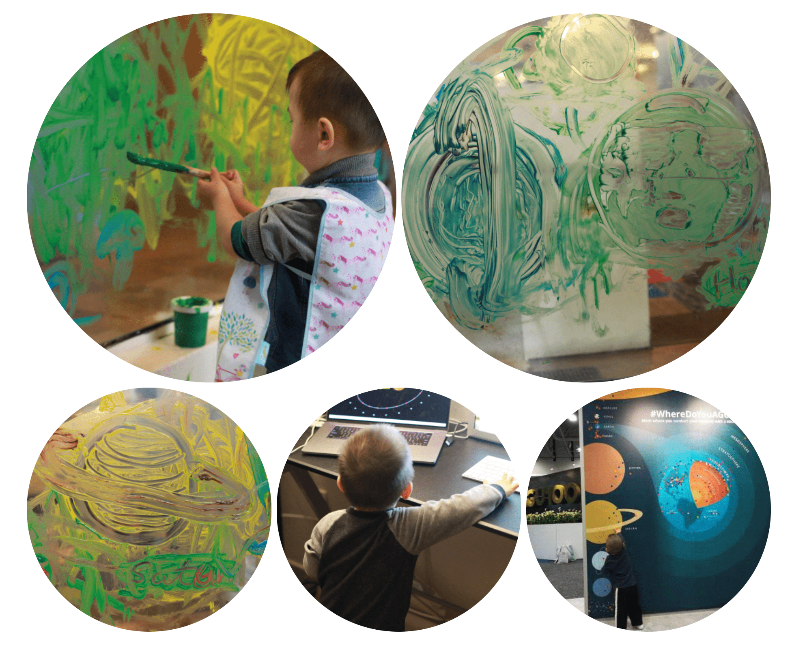
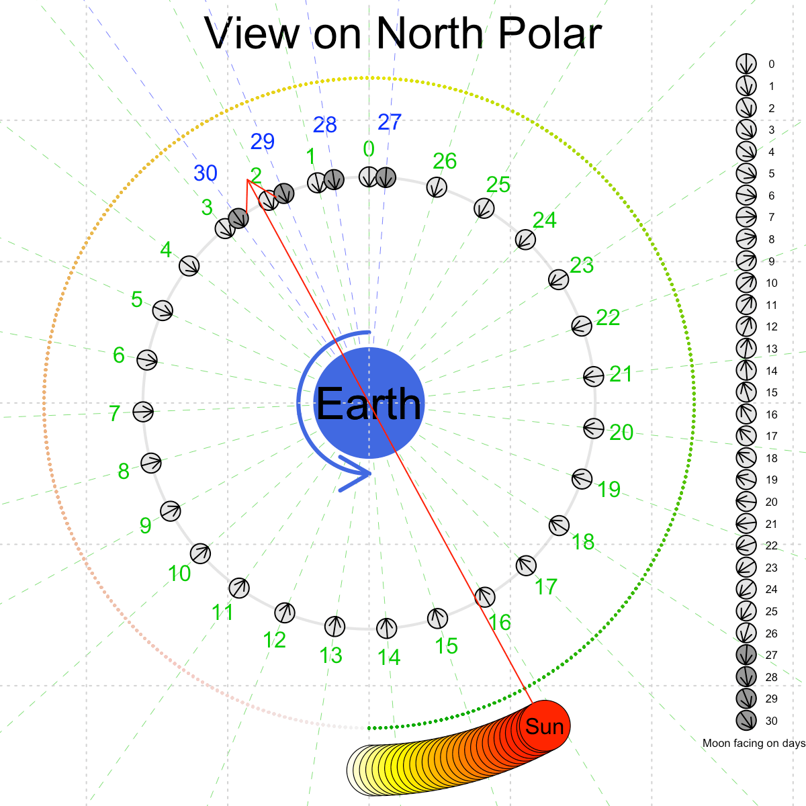
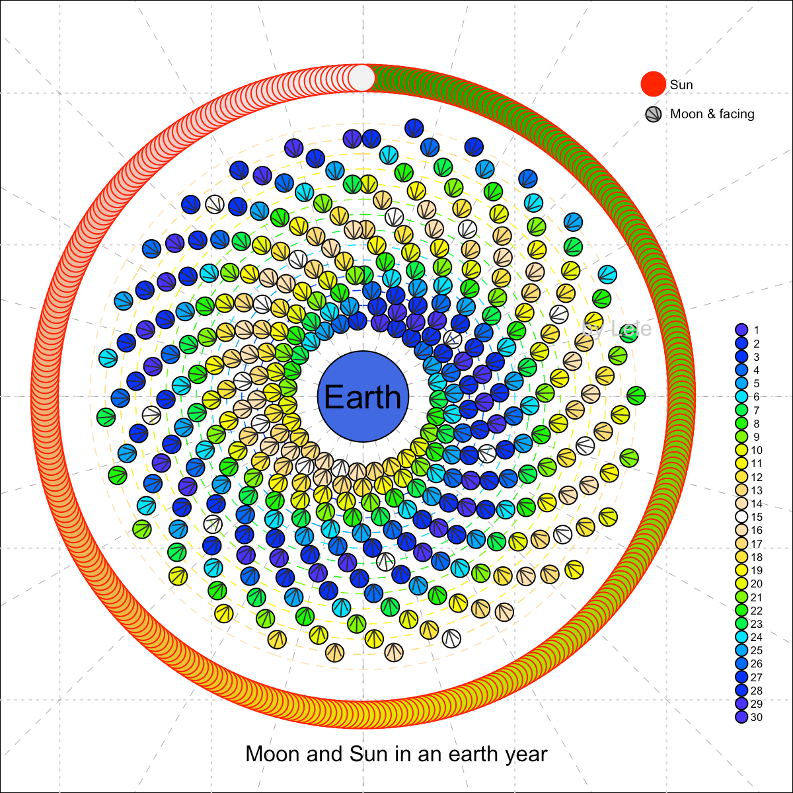

I planed to write an R package and submit on CRAN, that can plot the planets orbiting in Solar System or satellite/moon orbiting around Earth. That package must plot the moving planets, the moon, moon phase and satellite in 2D or 3D canvas. In the future, it may calculate the orbit based on orbit mechanics.

My son loves the song “The Wheels on the bus go round and round“, and he has an obsession with planets. He asks mommy to play the solar system documentary every night when we ask him to brush his teeth.  So I decided to plot the moving planets in the solar system for him with the scientific knowledge I know.

  |My son is obsessed by the planets and stars|
  |:--|
  |  |

Another motivation is from the Chinese lunar exploration, Chang-E 5, landing on the far-side of the moon.  Lots of people discussed it and were fuddled on the rotation of the moon and the relation between the Earth and the moon.

Furthermore, I kept thinking about the Chinese semi-lunar calendar for many years, I know the founder mental logic and algorithm of the calendar in my mind, but never scratched the equations and numbers in the paper yet.  This calendar is determined by the moon phase and the position of the Earth in orbit. Definitely, the solver in papers is more rousted in my brain.

Let’s see what I got, by now.

|The idea of the Moon and the Sun are moving around the Earth, when we assume the Earth is the center of the system. The orbital period of the moon is 27.321 days, but the synodic period is 29.53 days, that because the sun moves 27.321/365.25 in its sun’s orbit when the moon moves in the moon’s orbit. It requires 2.2 days to let the sun and the moon to face-to-face again.|
|:--|
|  |

  |The position of the Moon and the Sun in an earth year (365 days). The right legend shows the moon phase in 30 days. The concentric orbits are numbers of the moon periods.|
  |:--|
  |  |
