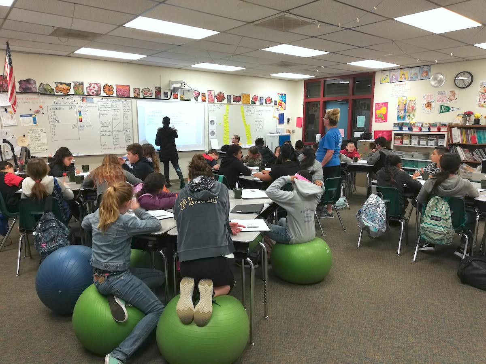
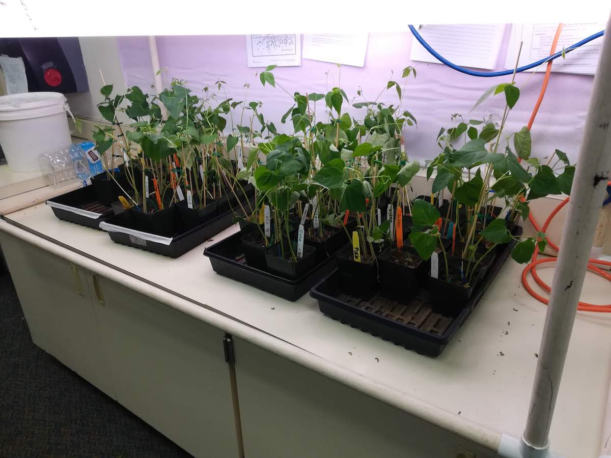
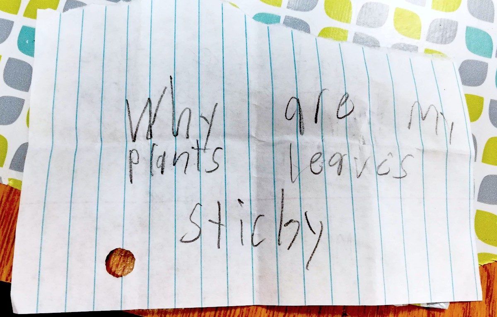

[external_link of the project](https://kidsdiscoveringscience.wordpress.com/about/)

## Motivation of the project
This is fantastic program to teach the local kids and lead them into the discovering sciences.

| Panoview of the Math&Science classroom.|
  |:--|
  |  |

#### Week 03:

|  Week 03: Jessica is writing students observation and discussion of plants in two different soils (Sperpentine and sandy loam). |
|:--|
|  |

#### Week 05:

|  Week 05: The growth condition of their beans. |
|:--|
|  |

| Week 05: One question from students' question box. Question: Why are my plants leaves sticky? |
|:--|
|  |
