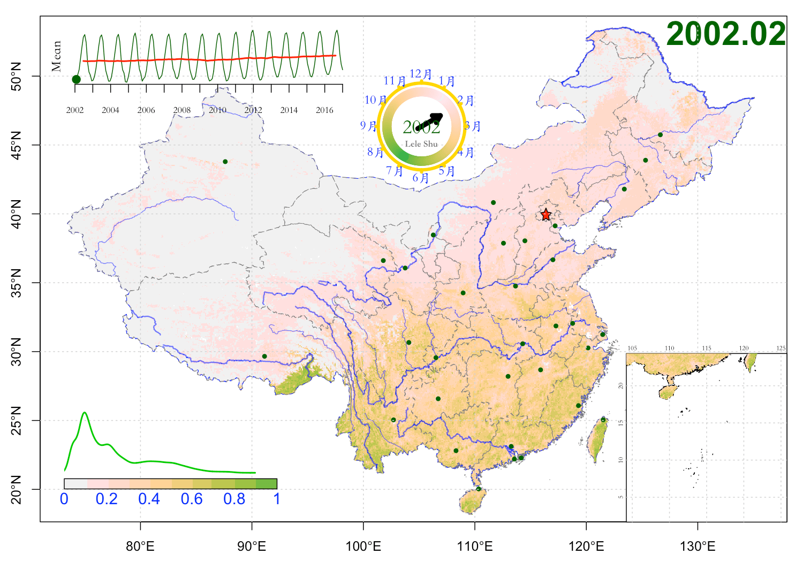

This script is to demonstrate the capability and scheme to realise the animation. You have to prepare your own data for this animation script.

# Script for Global NDVI


```{r}
rm(list=ls())
library(RoundAndRound)
# devtools::install_github('shulele/RoundAndRound')
col.fun=function(x){ colorspace::terrain_hcl(x, l=c(65,95),
                                             power=c(1/3, 1.5))  }
plotStar <- function(x, y, radius, angle=180, xyratio=1, ...){
  i <- 1:11
  alpha <- 2*pi / 10
  r <- radius * (i %% 2 + 1)/2
  omega <- alpha * i + angle * pi /180
  invisible(mapply(function(a, b, ...)
    polygon(r*sin(omega) + a, r*cos(omega) * xyratio + b, ...),
    x, y, ...))
}

# setwd("~/Dropbox/文章天下事/Drafts/2018-CAWildfireMap/Rcode")
#install.packages('ncdf4')
clib=c('ncdf4', 'raster','rgeos','rgdal','ggplot2', 'lattice')
tmp=lapply(clib, library, character.only=T)
key='NDVI_GLOBAL'
cn=FALSE
# cn=TRUE
if(cn){dir.gif = file.path('../gif', paste0(key, '_cn') )}else{
  dir.gif = file.path('../gif', paste0(key, '_en') )}
dir.in = file.path('/Volumes/WD8T/FireIndex/RDS/NDVI')
dir.fig = file.path('../figure', key)
dir.rds = file.path('../RDS', key)
dlist = list(dir.in, dir.fig, dir.gif, dir.rds);
tmp=lapply(dlist, dir.create, showWarnings = F, recursive = T)

crs0=crs('+init=epsg:4326')

rds.riv = '/Users/leleshu/Dropbox/PIHM/Projects/CommonData/Global/ne_10m_rivers_lake_centerlines_scale_rank/ne_10m_rivers_lake_centerlines_scale_rank.RDS'
sp.riv = readRDS( file =rds.riv)
map=readRDS('/Users/leleshu/Dropbox/PIHM/Projects/CommonData/Global/ADM/cntry02.RDS')
sp.prov = map
# map=gUnaryUnion(map)
crs(map)= CRS('+init=epsg:4326')
brk = sort(unique(c(-1, 0.2, seq(2 ,10, by = 1)/10) ))
brk = seq(0, 10, 1)/10
# cols=rev(colorspace::diverge_hsv(length(brk) ) )
cols=rev(col.fun(length(brk)));

ncols = length(cols)
pngout<-function(fn, wd = 12, ht = 8){
  png(fn, width=wd, height=ht, unit='in', res=150)
}
# years = 2010:2017;
years = 2002:2009;
ny=length(years)
# plot(map, axes=T)
# plotclock(time=c(1,NA,NA), add=T, orig=orig, rad=4, val=month.abb, ab=1.2)
if(cn){
  labs=c('1月','2月','3月','4月','5月','6月','7月','8月','9月','10月','11月','12月')
}else{
  labs=month.abb
}
# # library(foreach)
# library(doMC)
# library(doParallel)
# registerDoMC(6)
# plot(r)

xp=c(-180, 180, 180, -180)
yp=c(-90, -90, 90,90)
xt=seq(-180, 180, 30)
yt=seq(-90, 90, 30)
xtlab= rep('W', length(xt)); xtlab[xt>0]='E'; xtlab[xt==0]='';xtlab=paste0('°', xtlab)
ytlab= rep('S', length(xt)); xtlab[xt>0]='N'; xtlab[xt==0]='';ytlab=paste0('°', ytlab)

rcl=rbind(c(-1000, 0, 0), c(1, 10, 1) )
mygrid <- function(h=NULL, v=NULL,  lty=2, col='gray80', ...){
  fun.h=function(x){ abline(h=x,  lty=lty, col=col, ...)  }
  fun.v=function(x){ abline(v=x,  lty=lty, col=col, ...)  }
  if(!is.null(h)) tmp = lapply(h, fun.h)
  if(!is.null(v)) tmp = lapply(v, fun.v)
}

theta=1:360-90 - 360/12
cc.cols=col.fun(180)
cc.cols=c(cc.cols, rev(cc.cols))
cc=PCS2CCS(theta=theta, a=0.8)
ext=extent(map)
# x= foreach (iy = 1:ny) %dopar%{
for(iy in 1:ny){
  yr= years[iy]
  fn.in = file.path(dir.in, paste0('NDVI',yr,'.RDS'))
  message(iy,'/', ny, '\t',yr, '\t', fn.in)
  dat = readRDS(fn.in)
  tag = substr(names(dat), 2, nchar(names(dat)) )
  nmon = length(tag)
  for(i in 1:nmon){
    rx=dat[[i]]
    r=reclassify(rx, rcl)
    message(i,'/', nmon, '\t', tag[i] )
    ttl = paste0(substr(tag[i], 1,4), '.', substr(tag[i], 5,6) )
    pngout(file.path(dir.gif, paste0(key, tag[i], '.png')), ht=6, wd=10)
    par(mar=c(2.5,2.5,1,1))
    # plot(map, axes=T)
    # plot(map,  col='white', axes=T, border='transparent')
    plot(xp, yp, type='n', axes=F, asp=1, xlim = range(xp), ylim=range(yp)); box();
    axis(side=1, at=xt);
    axis(side=2, at=yt)
    polygon(xp,yp, border='lightskyblue', col='lightskyblue')
    plot(add=T, map,  col='white', axes=T, border='transparent')
    mygrid(h=yt, v=xt)
    plot(add=T, r, breaks=brk, col=cols, legend=FALSE, axes=F);
    mtext(ttl, side=3, cex=2.5, line=-2, font=2, col='darkgreen')
    plot(add=T, sp.riv, col=rgb(0,0,1, 0.3), lwd=.5)
    mygrid(h=yt, v=xt)
    par(fig=c(c(0.1, 0.3)+.0, c(0.1,0.24)+.16), new=T, mar=c(0,0,0,0))
    tmp=density(r, plot=F)
    plot(tmp$x, tmp$y, type='l',  lwd=3, bg='gray80', col=3, axes=F,
         xlim=c(0,1), ylim=c(-1,4.5))
    plot(r, legend.only=TRUE, breaks=brk, col=cols,
         smallplot=c(.0, 1, .0, .13),
         legend.width=5, legend.shrink=.7, cex=5, horizontal=T,
         axis.args=list(col.axis='blue', lwd = 0,
                        font.axis=1, cex.axis=1, tck = 0, line=-.85,
                        labels=brk, cex.axis=1.2),
         legend.args=list(text='',col=4, side=3, font=1, cex=1.5)
    )
    x.mon=as.numeric(substr(tag[i], 5,6))
    if(cn){
      par(fig=c(c(0.3, 0.55)+.28, c(0.6,0.86)+.05), new=T, mar=c(0,0,0,0)
          ,family='STKaiti')
    }else{
      par(fig=c(c(0.3, 0.55)+.28, c(0.6,0.86)-.4), new=T, mar=c(0,0,0,0)
      )
    }
    plot(0, type='n', axes=F, xlab='', ylab='', xlim=c(-1,1)*1.5, ylim=c(-1,1)*1.5, asp=1)
    plotclock(time=c(x.mon,NA,NA),rad=1.1, val=labs, axes=F, add=T, fun.plot = polygon,
              val.arg = list(col=4, cex=.95))
    # color ring.
    points(cc, col=cc.cols, cex=1.4, pch=19)
    dev.off()
    # stop('stop')
  }
}

fps=6
fn.mov = file.path(dirname(dir.gif), paste0(key,'_', fps,'fps.mp4') )
cmd = paste('ffmpeg -r ', fps,  '-f image2 -s 1920x1080 -i ', paste0(dir.gif, '/*.png'),
            '-vcodec libx264 -crf 25  -pix_fmt yuv420p', fn.mov)
print(cmd)
# system(cmd)
```

# Script for China NDVI

```{r}
rm(list=ls())
# devtools::install_github('shulele/RoundAndRound')
library(RoundAndRound)
library(xts)
col.fun=function(x){ colorspace::terrain_hcl(x, l=c(65,95),
                                             power=c(1/3, 1.5))  }
plotStar <- function(x, y, radius, angle=180, xyratio=1, ...){
  i <- 1:11
  alpha <- 2*pi / 10
  r <- radius * (i %% 2 + 1)/2
  omega <- alpha * i + angle * pi /180
  invisible(mapply(function(a, b, ...)
    polygon(r*sin(omega) + a, r*cos(omega) * xyratio + b, ...),
    x, y, ...))
}
#install.packages('ncdf4')
clib=c('ncdf4', 'raster','rgeos','rgdal','ggplot2', 'lattice')
tmp=lapply(clib, library, character.only=T)
key='NDVI_CN'
# cn=FALSE
cn=TRUE
if(cn){
  dir.gif = file.path('../gif', paste0(key, '_cn') )
}else{
  dir.gif = file.path('../gif', paste0(key, '_en') )
}
dir.in = file.path('../RDS/NDVI_CN/')
dir.fig = file.path('../figure', key)
dir.rds = file.path('../RDS', key)
dlist = list(dir.in, dir.fig, dir.gif, dir.rds);
tmp=lapply(dlist, dir.create, showWarnings = F, recursive = T)

crs0=crs('+init=epsg:4326')
sp.prov = readRDS( file = file.path(dir.rds, 'province.RDS'))
sp.cn=readRDS(file = file.path(dir.rds, 'map.RDS'))
sp.city = readRDS( file = file.path(dir.rds, 'city.RDS'))
sp.riv = readRDS( file = file.path(dir.rds, 'riv.RDS'))

# map=readRDS('../RDS/CONUS.RDS')
ext=extent(sp.cn)
ia=gArea(sp.cn, byid = T)
id=order(ia, decreasing = T)[1:6]
map=sp.cn[id, ]
map@data=data.frame(1:6)
crs(map)= CRS('+init=epsg:4326')
brk = sort(unique(c(-1, 0.2, seq(2 ,10, by = 1)/10) ))
brk = seq(0, 10, 1)/10
# cols=rev(colorspace::diverge_hsv(length(brk) ) )
cols=rev(col.fun(length(brk)));

ncols = length(cols)
pngout<-function(fn, wd = 12, ht = 8){
  png(fn, width=wd, height=ht, unit='in', res=150)
}
years = 2010:2017;
years = 2002:2017;
ny=length(years)
# plot(map, axes=T)
# plotclock(time=c(1,NA,NA), add=T, orig=orig, rad=4, val=month.abb, ab=1.2)
if(cn){
  labs=c('1月','2月','3月','4月','5月','6月','7月','8月','9月','10月','11月','12月')
}else{
  labs=month.abb
}
# # library(foreach)
# library(doMC)
# library(doParallel)
# registerDoMC(6)
# plot(r)
iy=1
rid1=which(as.numeric(sp.riv@data$JB) ==1)
rid2=which(as.numeric(sp.riv@data$JB) ==2)
ct.xy=coordinates(sp.city)
ct.txt=as.character(sp.city@data$PINYIN)

theta=1:360-90 - 360/12
cc.cols=col.fun(180)
cc.cols=c(cc.cols, rev(cc.cols))
cc=PCS2CCS(theta=theta, a=0.8)
go<-function(){
  tsd=readRDS(file.path(dir.rds, paste0(key,'.TSD.RDS')) )
  tsd=cbind(tsd, movingFun(tsd, 12))
  txx=coredata(tsd)
  xt=seq(min(years), max(years), length.out = 12*(diff(range(years))+1) )
  mat=cbind(xt, txx)
}
tsd=go()

# x= foreach (iy = 1:ny) %dopar%{
for(iy in 1:ny){
  yr= years[iy]
  fn.in = file.path(dir.in, paste0('NDVI',yr,'.RDS'))
  message(iy,'/', ny, '\t',yr, '\t', fn.in)
  dat = readRDS(fn.in)
  tag = substr(names(dat), 2, nchar(names(dat)) )
  nmon = length(tag)
  for(i in 1:nmon){
    rx=dat[[i]]
    r=mask(rx, map)
    # r=rx
    message(i,'/', nmon, '\t', tag[i] )
    ttl = paste0(substr(tag[i], 1,4), '.', substr(tag[i], 5,6) )
    graphics.off()
    pngout(file.path(dir.gif, paste0(key, tag[i], '.png')), ht=7, wd=10)
    par(mar=c(2.5,2.5,1,1))
    # plot(map, axes=T)
    plot(map,  border='gray80', axes=T, ylim=c(19, 53), xlim=c(74, 135))

    r[r<0]=0
    r[r>1]=1
    plot(add=T, r, breaks=brk, col=cols, legend=FALSE);
    mtext(ttl, side=3, cex=2.5, line=-2, adj=1, font=2, col='darkgreen')
    plot(map, add=T, border = 4, lwd=.7, lty=2)
    plot(add=T, sp.prov, border='gray50', lwd=.7, lty=2)
    plot(add=T, sp.riv[rid1, ], col=rgb(0,0,1, 0.6), lwd=1.5)
    plot(add=T, sp.riv[rid2, ], col=rgb(0,0,1, 0.6), lwd=.8)
    plot(add=T, sp.city, pch=20, col='darkgreen')
    plotStar(ct.xy[1,1], ct.xy[1,2], .5, pch=3, col=2)
    # text(ct.xy, ct.txt, cex=.5)
    grid()
    # xloc=c(0.05, 0.3); yloc=c(0.1,0.13)
    # plot(r, legend.only=TRUE, breaks=brk, col=cols,
    #      smallplot=c(xloc+.03, yloc+.02),
    #      legend.width=5, legend.shrink=.7, cex=5, horizontal=T,
    #      axis.args=list(col.axis='blue', lwd = 0,
    #                     font.axis=4, cex.axis=1.5,tck = 0, line=-.85,
    #                     labels=brk, cex.axis=1.2),
    #      legend.args=list(text='',col=4, side=3, font=2, cex=1.5)
    # )
    # dev.off();plot(r)

    par(fig=c(c(0.04, 0.305)+.04, c(0.1,0.24)+.03), new=T, mar=c(0,0,0,0))
    tmp=density(r, plot=F)
    plot(tmp$x, tmp$y, type='l', axes=F, lwd=2, bg='gray80', col=3,
         xlim=c(0,1), ylim=c(-1,4.5))
    plot(r, legend.only=TRUE, breaks=brk, col=cols,
         smallplot=c(.0, 1, .0, .13),
         legend.width=5, legend.shrink=.7, cex=5, horizontal=T,
         axis.args=list(col.axis='blue', lwd = 0,
                        font.axis=1, cex.axis=1, tck = 0, line=-.85,
                        labels=brk, cex.axis=1.2),
         legend.args=list(text='',col=4, side=3, font=1, cex=1.5)
    )

    x.mon=as.numeric(substr(tag[i], 5,6))
    if(cn){
      par(fig=c(c(0.3, 0.55)+.1, c(0.6,0.85)+.05), new=T, mar=c(0,0,0,0),
          family='STKaiti')
    }else{
      par(fig=c(c(0.3, 0.55)+.1, c(0.6,0.85)+.05), new=T, mar=c(0,0,0,0))
    }
    plot(0, type='n', axes=F, xlab='', ylab='', xlim=c(-1,1)*1.5, ylim=c(-1,1)*1.5, asp=1)
    plotclock(time=c(x.mon,NA,NA),rad=1, val=labs, axes=F, add=T, fun.plot = polygon,
    val.arg = list(col=4, cex=.95))
    # color ring.
    points(cc, col=cc.cols, cex=1.4, pch=19)
    # text(0, 0, ttl, col='gray', cex=1.2)
    text(0, 0, years[iy], col='darkgreen', cex=1.5)
    text(0, -0.4, "Lele Shu", col='gray40', cex=.7, font=2, family='Kaiti SC')
    # South Sea
    par(fig=c(c(0.7, 0.9)+.08, c(0.1,0.4)-.029), new=T, mar=c(0,0,0,0))
    plot(sp.cn, type='n', axes=F, xlab='', ylab='',
         xlim=c(105,125), ylim=c(6,20))
    plot(add=T, sp.riv[c(rid1,rid2), ], col=rgb(0,0,1, 0.6), lwd=1)
    box(lty='solid'); grid()
    axis(side=3, cex.axis=.5, tick=NULL, lwd=0, line=-1, font=2)
    axis(side=2, cex.axis=.5, tick=NULL, lwd=0, line=-1, font=2)
    plot(add=T, r, breaks=brk, col=cols, legend=FALSE);
    #     TREND
    par(fig=c(c(0.04, 0.4)+.04, c(0.1,0.2)+.75), mgp = c(0, 1, 0), new=T, mar=c(0,0,0,0))
    matplot(tsd[,1], tsd[,-1], xlab='', ylab='', type='l', axes=F,
            col=c('darkgreen', 'red'), lwd=c(1,2), lty=1);
    axis(side=1, at=years, cex.axis=.7, font.axis=4)
    tid=i+(iy-1)*12
    points(tsd[tid, 1], tsd[tid, 2], pch=20, col='darkgreen', cex=2);
    mtext(side=2, 'Mean')
    dev.off()
    # stop('stop')
  }
}

fps=6
fn.mov = file.path(dirname(dir.gif), paste0(key,'_', fps,'fps.mp4') )
cmd = paste('ffmpeg -r ', fps,  '-f image2 -s 1920x1080 -i ',
            paste0("'", dir.gif, '/*.png', "'"),
             '-vcodec libx264 -crf 25  -pix_fmt yuv420p', fn.mov)
print(cmd)
system(cmd)
```
