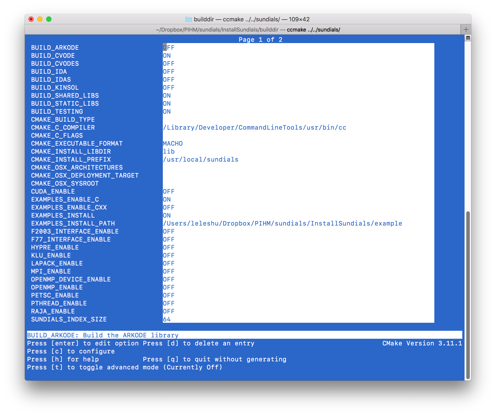
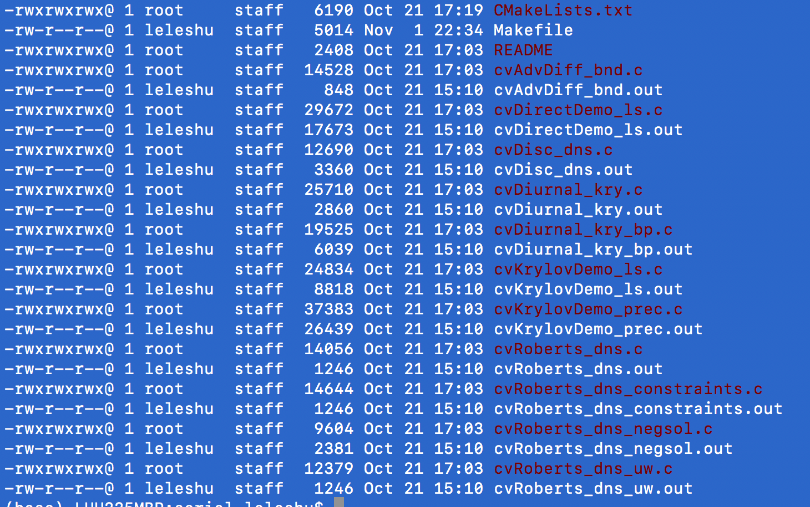
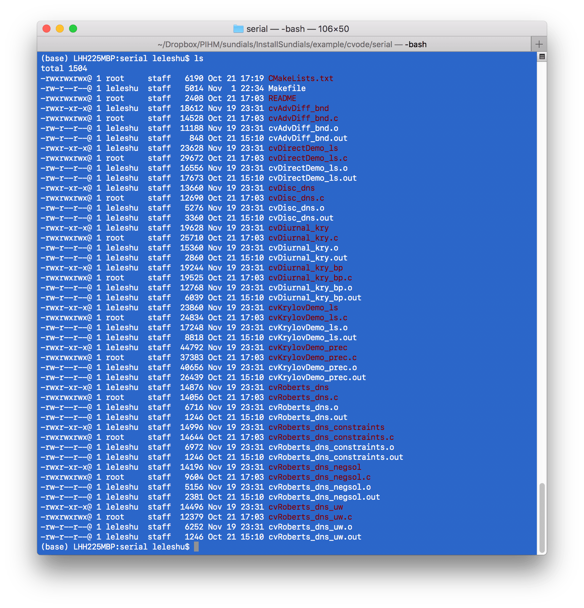
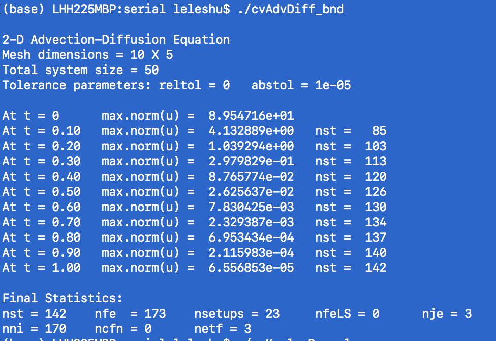

## SUNDIALS: SUite of Nonlinear and DIfferential/ALgebraic Equation Solvers
SUNDIALS (https://computing.llnl.gov/projects/sundials) is a very powerful mathematical library that is helpful in solving engineering and scientific problems efficiently. CVODE is one of the tools, aiming to solve the Ordinary Differential Equation, in C language.
In the Simulator for Hydrologic Unstructured Domains (SHUD) model, the system of ODEs describing the hydrological processes is fully coupled and solved simultaneously at each time step ($ \Delta t=t_{n}-t_{n-1}$)  using CVODE, a stiff solver based on Newton-Krylov iteration.

The latest version of SUNDIALS is v5.0.0, released in November 2019. Let's install it on a Mac OS or Linux system.


I test the installation on **Mac 10.13** and  **Ubuntu 18.04.3 LTS (GNU/Linux 4.15.0-66-generic x86_64)**

1. Download SUNDIALS, via https://computing.llnl.gov/projects/sundials/sundials-software.
  Or get latest SUNDIALS on GitHub:

  ```
  git clone https://github.com/LLNL/sundials.git
  ```

  Now, you must have the source code of SUNDIALS in your folder.
  Please enter the folder.
  Let's assume you are in the same level of _sundials_.


2. Create an install folder.

  The installation folder names **installSundials**

  ```
  mkdir installSundials
  cd installSundials

  rm -rf builddir instdir srcdir

  mkdir builddir
  mkdir instdir
  mkdir srcdir

  cd builddir/
  ```

3. Configure the installation with CCMAKE.

  There are two ways to configure the installation. One is GUI, and the other is the command line.

  - **Option 1**, type command blow:

  ```
  ccmake ../../sundials/
  ```

  You will see a screen like this:
  

  Use your cursor, move to line ***CMAKE_INSTALL_PREFIX***, which is the path SUNDIALS will be installed. Press Enter to start to edit the line. I install it on **/usr/local/sundials**

  Another path you may change is the path of example code, ***EXAMPLES_INSTALL_PATH***.

  Next, you need to select which solver you want to install, such as, ARKODE, CVODE, CVODES IDA, IDAS, KINSOL. They are on the top of your GUI; press Enter to enable or disable it. Since I need the CVODE only, I turn the ***BUILD_CVODE*** option ON and keep the rest of them OFF.

  If you have OpenMP on your machine and you need the support of OpenMP parallel in your program, you can turn the *OPENMP_ENABLE* ON.

  After edits, press **C** to configure, and press **C** again, when **g** option shows up on the bottom, press **g** to generate configuration files.


  - **Option 2**, you can use command to realise the edits above, for example:

  ```
  cmake -DCMAKE_INSTALL_PREFIX=/usr/local/sundials \
   -DEXAMPLES_INSTALL_PATH=../example \
   -DBUILD_CVODE=ON \
   -DBUILD_CVODES=OFF \
   -DBUILD_ARKODE=OFF \
   -DBUILD_CVODES=OFF \
   -DBUILD_IDA=OFF \
   -DBUILD_IDAS=OFF \
   -DBUILD_KINSOL=OFF \
   -DOPENMP_ENABLE=ON \
   ../../sundials/
  ```

  The command above configure the installation, to install SUNDIALS to */usr/local/sundials*, the examples to *../example*, install *CVODE* only, with OpenMP support.

  If you don't need OpenMP or your OpenMP may result in errors, use the command below:

  ```
  cmake -DCMAKE_INSTALL_PREFIX=/usr/local/sundials \
   -DEXAMPLES_INSTALL_PATH=../example \
   -DBUILD_CVODE=ON \
   -DBUILD_CVODES=OFF \
   -DBUILD_ARKODE=OFF \
   -DBUILD_CVODES=OFF \
   -DBUILD_IDA=OFF \
   -DBUILD_IDAS=OFF \
   -DBUILD_KINSOL=OFF \
   -DOPENMP_ENABLE=OFF \
   ../../sundials/
  ```


4. make and install

  This is simple and easy, run:

  ```
  make
  make install
  ```

  Sometimes, if the system may require higher privileges. If so, please try to use sudo:

  ```
  make
  sudo make install
  ```

  If there is no error occurs, the SUNDIALS is installed successfully. Congrats.

5. Test the SUNDIALS library with the examples.

  Enter the example folder,  *../example* as the **Option 2** in step 3. You will see several examples.
    

  Use make to compile all of them:

  ```
   cd ../example/cvode/serial/
   ls
   make
  ```

  After make, you will see files like this:

  

6. Test the program:

   ```
   ./cvAdvDiff_bnd

   ./cvKrylovDemo_ls
   ```

  


Now, you can use SUNDIALS/CVODE in your own numeric solver.

Be patient; you will meet more challenges.
