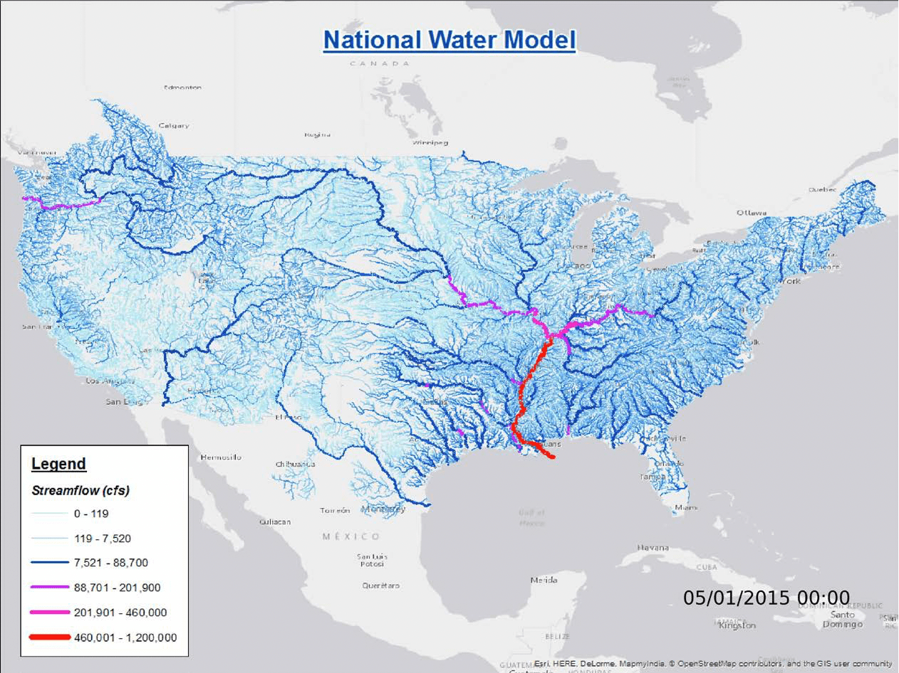
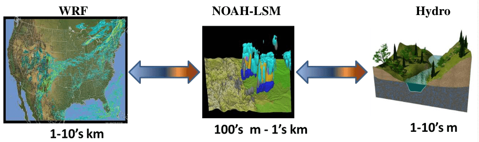
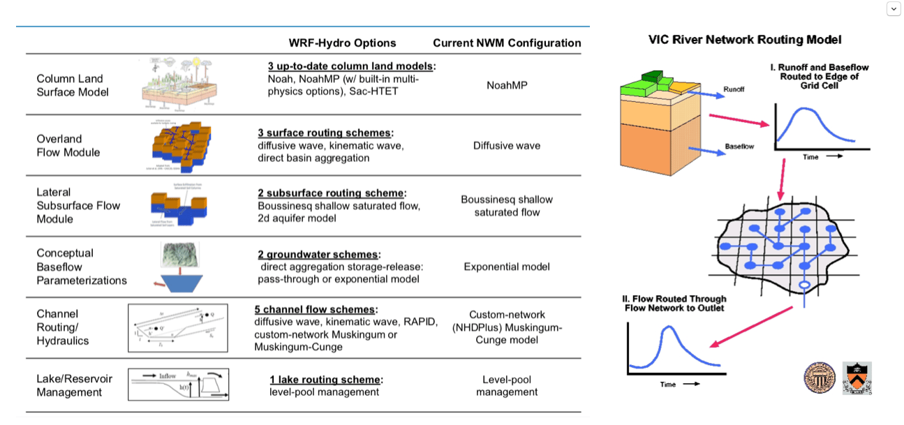
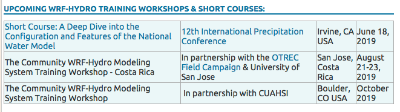

WRF-Hydro做得非常好。 

能够完成大尺度(全美国900万平方公里)**实时的洪水预报**，这个就已经超出所有分布式水文模型的能力了。而且他们在推广上面作了非常好的工作，数据的预处理后处理都有完整的解决办法，还**免费开班授课**推广WRF-Hydro。

 下图用WRF-Hydro做出来的全美国河流流量图。这个图可以实时预测每条河流的流量，非常强大。

它最重要的突破应该是在耦合上面，给WRF的模拟一个更精细的边界层模拟，WRF和NOAH LSM的一层耦合，NOAH与Hydro又一层耦合，这个在时间和空间分辨率上的复杂耦合关系它都处理得非常得当。 也许它最初的名字应该叫WRF-NOAH-Hydro模型，而不是WRF-Hydro。WRF-Hydro模型耦合上做得非常非常好的案例。 

我们组上周（2019.06）的在北卡罗来纳Ashevill的项目总结会也是讨论模型耦合，耦合流域、湖泊、农业和社会经济，叫**Coupled-Human-Nature System**，是NSF的资助，几个大学合作做了3年，有很多进步但还算不上“耦合”，只能到数据单向连接的程度，用于科学研究尚可，不能做应用预报。 美国DARPA还有一个叫MINT的项目，基本思路也是耦合，也还没有到达“耦合”的程度，将来做预报和决策。项目里面做技术的是南加州大学做人工智能方向的人，但是他们不懂也不愿意懂模型，搞不清楚各种模型的数据意义和时空错位问题。所以我挺担心将来他们暴力链接数据，弄出搞笑结果来。 当然了，这种把自然和人类社会耦合模拟，的确比多种自然过程的耦合模拟更难。未来前景未知。

不过WRF-Hydro在水文层面上的处理相当简单了，我觉得像是从大气-陆面-水的设计思路，也很像VIC-Routing的解决方式。 蒸发、下渗、产流、地下水补给都是由NOAH在较粗的分辨率上完成，Hydro部分计算时空分辨率更高，要实现Overland Routing, River Routing，Groundwater baseflow和湖泊。Routing都是一维、单向流动，地下水的处理是不具有物理意义的Bucket Model。湖泊也是个Bucket Model。 Noah和Hydro的交互是通过前时间步长的水量做权重分配。

下面两张图是WRF-Hydro的水文过程的思路和计算办法(左)和VIC Routing(右)的办法。

 WRF-Hydro的思路能很好的模拟大气、水、能量在时空上的变化，但是在水文学家来看，水的模拟有很多改进空间（当然是根据具体的需求）。 WRF-Hydro更重视大尺度的洪水问题，主要就是关心河道洪水，所以它的处理办法速度快、计算稳定、模型预热快、参数也容易调。通过计算出来河道的流量、对比测量的河道Rating Curve，可以推算洪水发生的位置和可能性，做出预报。 

WRF-Hydro的限制就是除了河道、积雪、土壤水量之外的水文变量——地下水、Baseflow、Percolation等等都不够可靠，更进一步也限制了它与其他水资源、环境、水质、地貌、生态、BioBGC的耦合。所以它关心的终极目标可以说是河道中水的流量； 它可以预报洪水流量，但是对于淹没区等等的信息就不够可靠了。 如果使用isotope和Water Age等数据来挑战它的计算，很可能出现大的偏差。 当然了，能解决上述这些限制的水文模型，必然是求解速度很慢的模型了。

再讲讲水文模型。

对水文模型而言，**物理性(1)、准确性(2)、求解速度(3)**应该是个不可能三角。统计模型和数据挖掘在2/3上做得不错，1就很差了。PIHM，PAWS，tRIBs, ModFlow, ParFlow,GSflow等等在1/2都不错，但是3非常差。1/2/3都比较平衡的也有，简单的如Topmodel，新安江模型，复杂的如PRMS和SWAT。 

以上速度慢的都使用了有限体积(FV), 有限元(FE)、有限差分(FD)等等数值求解办法，FV/FE/FD方法利用非常广泛，但是那些最经典应用都得益于其问题设计，求解域内存量和流量在时间、空间上的变化具有稳定性或者惯性，于是理论求解矩阵比较规矩（稀疏矩阵、对称矩阵、条形矩阵等等柔性矩阵），例如工程上的热传递和单纯的河道水动力学问题。

相比之下，水文中将地表、地下和河道的计算同时包含的矩阵就非常刚性(Stiff Matrix)，求解非常困难。这一困难主要是由水文问题的空间特征决定的，空间的不同计算单元的形状，参数的差异性太大了。 即便是Modflow, M3D这种专门针对地下水的简单模型(问题求解使用同一公式)，应对空间异质性都有很高的挑战。

水文使用FE/FD另外一个挑战是变量时间上的变化速度，计算都要满足CFL Condition才能保证收敛性；CFL与变化速度相关，但是河道、地面、地下水等等的流速都有数量级上的巨大差异，于是在求解的时间步长上的要求非常高。当地下水流动可以在小时甚至天间隔上收敛的同时，河道需要在分钟甚至秒的步长上保证收敛，于是同时求解的步长就需要在分钟和秒的级别计算。所以现阶段的最常见提速办法都是分别计算域，然后同步——也就是相当于依次计算多个域，然后不同域在特定时间步长上交换变量，成为各自的边界条件。PAWS和WRF-Hydro的是这样处理时间步长的。 用FE/FD方法水文建模的人，与其说是水文学家，不如说是水文-计算-软件学家。

**回到WRF-Hydro， 如果关心实时洪水和大气耦合，WRF-Hydro是非常棒的。**

给WRF-Hydro做个广告，想上课的朋友搜“WRF-Hydro Training”，春秋两季都开课，研究生和博士后都可以申请到500美元的Travel Funding。

 