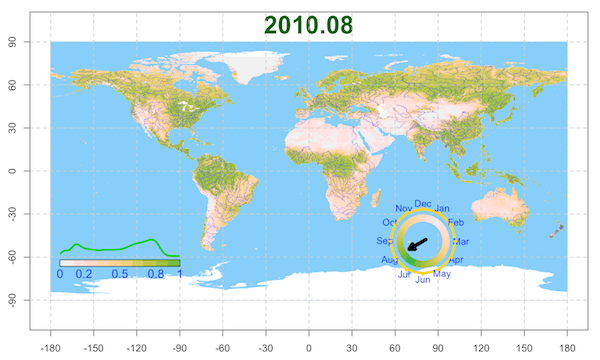

<!--  -->

The normalized difference vegetation index (NDVI) is a simple graphical indicator that reflect the greenness and the heath condition of vegetations.

The raw data is from [NASA MOD13A](https://modis.gsfc.nasa.gov/data/dataprod/mod13.php).


- The global NDVI variation from 2002 to 2017.




- The NDVI varies from 2002 to 2017 in US (Continental)

## How to download the rawdata
The code of the monthly NDVI from MODIS dataset is MOD13C2, so type the code below in your terminal and the wget will download all availalble data from server to you local matchine.

```
wget  --user=XXXXX --password=XXXX -r -c -np -x https://e4ftl01.cr.usgs.gov/MOLT/MOD13C2.006/
```

*The R package RoundAndRound and PIHMgisR is used for this data processing and visulization.*
