先上结论：**这篇文章是一个非专业记者的不专业报道。** 这是篇新闻( Nature News)，并不是篇科学论文，所以见到《Nature》就膝盖软的先平身。

**为什么说这篇文章非常不靠谱？ 分四节来说**

1. 这个文章写了什么，怎么写的
2. 究竟植树有没有好处？
3. 几个扩展问题。
4. 这个文章怎么写才靠谱？

## **第一节： 这个文章写了什么，怎么写的**

**文章标题： China’s tree-planting drive could falter in a warming world。 全球变暖或将削弱中国的植树动机。**

**副标题：**Researchers warn that the country’s push to hold back its deserts could strain water resources. 研究者警告，中国的**治沙行动**可能使水资源不堪重负。

文章标题单看没什么问题。但副标题说治沙行动导致水资源紧张，在文章中缺乏足够的证据。 文章的主标题和副标题分别用了“种树”和“治沙”两个相关却不同的概念，文章内部指责的基本上是“种树”。

文章配图的图1

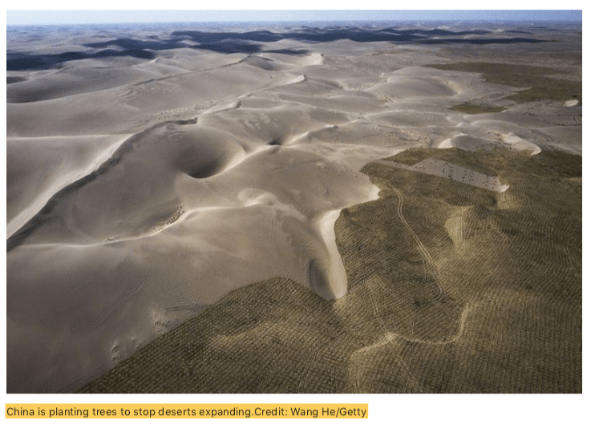

​	*配图文字写：中国正通过种树来阻止沙漠扩展*


上面这个配图写的是中国**种树**来阻止沙漠扩张，图片上沙漠和“**树**"泾渭分明，广袤的沙漠和”树“一线之隔。但实际上，地图上并不是树，甚至很难说是植被，它叫”草方格“，是中国沙漠地区防止沙漠扩展非常有效的手段。 **作者先入为主告诉你中国大面积种的就是树、树、树、树，一切都以种树为靶子开始**，但是配图是草方格。本文后面有专门对治沙的草方格有介绍。

> 第10段The growth of forests is significant and necessary progress in the fight against desertification, says Jianping Huang, a climate researcher at Lanzhou University
> (**兰州大学 黄建平，种树可以抵御沙漠化**). （注：所有翻译都是大意。下同）
> 第11段But it’s still too early to determine whether it has solved the problem, says Congbin Fu, director of the Institute for Climate and Global Change Research at Nanjing University. Land restoration is usually a long-term process — it can take several decades or even 100 years, he says.（**南京大学符淙斌：说它已经解决沙漠化为时过早；生态恢复需要较长时期，甚至100多年**

在科学研究里面，这两个老师的话都是正确的，各自都有坚实的研究支撑。但是作者把他们放在了一起，是想用后者的话否定前者的观点。**看似是科学家之间的否定，其实是作者想要表达的意思。**

> 第13段Then there are water shortages. **Large parts of China** — including some areas where trees are being planted — **are becoming drier**. A study2 published online in July found that semi-arid areas in the country grew by **33% between 1994 and 2008 compared to between 1948 and 1962**. Another paper3, co-authored by Sternberg, found that **arid areas in China had increased by roughly 1.6 million square kilometres**, about the size of Iran, since 1980 — probably due in large part to **anthropogenic climate change**. 引文2：对比1948-1962和1994-2008，半干旱面积增加33%. 引文3: 自1980年中国的干旱面积增加160万平方公里，主要是由于1980年来的人类活动带来的气候变化(**anthropogenic climate change)**。

第一句说部分已经植树的地区也变干了。引文2（study2）是引兰州大学黄建平老师的研究，半干旱面积从1948-1962到1994-2008增长了33%。 但是，黄老师在文章里面明确说了**“60年的变干和亚洲夏季季风变弱有关”**，没有提过植树造林的问题或者forest一词没有在文章出现过。

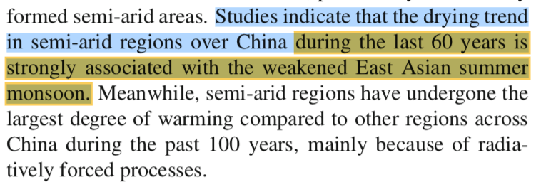

​	*引文2 Huang, J., Ma, J., Guan, X., Li, Y.He, Y. Adv. Atmos. Sci. 36, 922–937 (2019).*

引文3(paper3)作者的原话是：Therefore, amid the expansion of drylands and **anthropogenic impact**, China is already facing a massive amplification of land degrada- tion (soil water erosion, aeolian sandy desertification) in vast regions in the north-west, north and north-east, which generally overlap the Taklamakan, Badain Jaran, Tengger and Gobi deserts。 也就是引文3的**作者认为人类的活动是导致当地沙漠化的原因。**Nature的新闻作者没有说是哪些年份，数据是2000之前的情况，很多中国学者都有与引文作者相同的研究和结论，80-90年代粗放式发展和气候变化导致了沙漠化。这些年沙漠化加剧才导致国家重视退耕还林还草还牧，尤其是**1999**年之后恢复青山绿水的国家“**退耕还林工程**”启动，全国的自然状况得到明显改善，后面很多数据和研究都能支持这变化一。 **很多研究表示中国自然环境变好都是从2000年之后开始，其中就包括被引用的符淙斌老师的研究。**

新闻作者在这里还是犯了一个错误。“**arid areas...increased...** probably due in large part to **anthropogenic climate change”.** 植树造林目的正是为了修复过度土地开发——开荒种地、城市化造成的环境恶化，历史的过度开发就属于人类活动引起的气候变化**anthropogenic climate change**，但同时植树造林也属于人类活动，但是文章主题是植树造林的问题，提到这个沙漠化是由于人类活动造成的时候，这个时候需要说明是哪一种人类活动——是破坏原生植被的人类活动还是试图修复植被的人类活动。但是文章主题是讨论种树，这里不说清楚是哪种，读者自然会误认为是植树的人类活动造成了负面结果。

**并不是植树或者绿化工程导致变干和沙漠化，而是气候+人类过度开发活动导致的**。但是作者也许在暗示植树造林导致的干旱或者沙漠化，这正符合文章的标题和副标题。

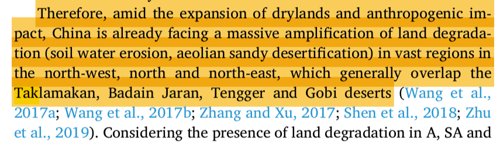

引文3 Prăvălie, R., Bandoc, G., Patriche, C.; Sternberg, T. CATENA 178, 209–231 (2019).

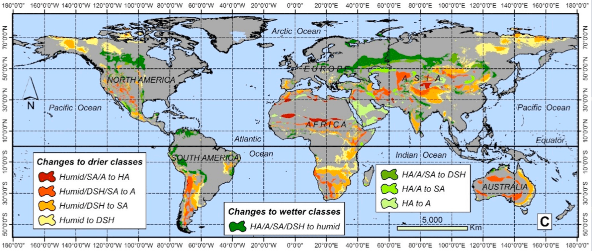*引文3中的这个图展示了全球在过去40年变干旱的地区。美国，澳大利亚和非洲都有大面积变干旱。Nature的记者拿这篇研究评论中国植树造林效果论据不足。*

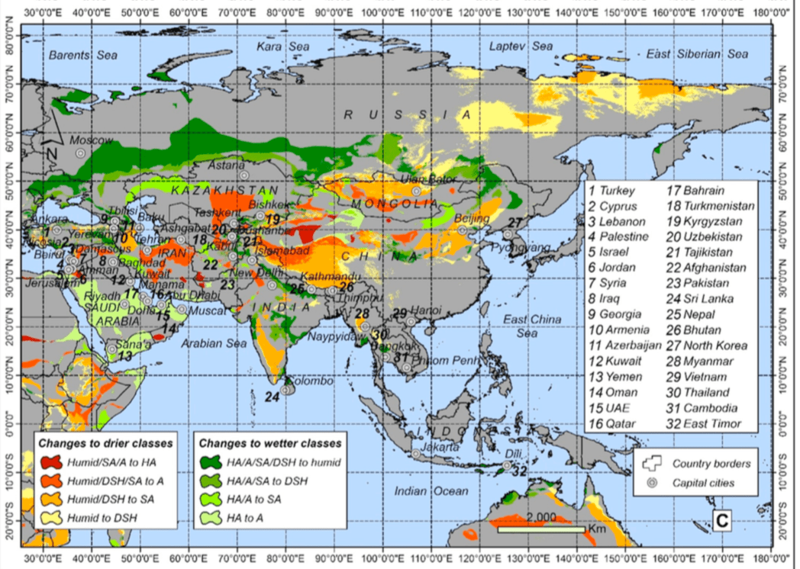*引文3这个图展示了中国哪些区域是变成干旱地区。绝大部分的面积是在青藏高原。所以文献作者如何定义干旱地区是个大问号，需要科学讨论。 最严重的干旱发生在罗布泊，这个正常——上游断水下游干旱，但这和中国植树造林没有关系。如果有关系的话，可以看看内蒙和陕北一带的绿色属于三北防护林*

> 第14段Many of the plant species introduced to the Loess Plateau use more water than native vegetation. A 2016 **study5** co-authored by Ciais found that the revitalized ecosystem is already sucking up rainfall and reducing the amount of water that runs off to rivers; a drier climate could exacerbate the situation and trigger water shortages for humans. A modelling **study6** co-authored by Fu and published last month reached similar conclusions, and cautioned against continuing the Grain for Green Program.

第一句说大量非原生植物被种植在黄土高原，这类植物用水更多，不知道他的证据是什么。至少6篇文献里面只有引文4出现了原生和非原生植被问题（Hua, F.*et al.Biological Conservation***222**, 113-124 (2018).)。但引文的论述不是针对**西北部黄土高原(** Loess Plateau**)**，而是一个专门针对中国四川中南部(乐山-眉山-雅安一带)植树造林的问题，西南植树的目的是经济林，这里年均降雨量超过**1200毫米**，是非常湿润的地区，并不涉及水资源争夺而是水土保持和森林生态系统，也与文章主副标题关系不大。

引文5说植被多河流径流少在水文中很符合科学的逻辑，植被能够减少降雨快速汇入河道、增加入渗，有的情况下只是水在空间的重新分配，如果没有地下水储量的变化数据，我们需要谨慎的说水资源的变化。 作者生态中心冯晓明在文章中说**植被和人口的承载量接近水资源的可用量，是建议植被的最大适宜量已经达到了，不可再进一步绿化**。引文5的作者冯晓明的工作非常非常详细扎实，发在nature子刊。这篇文章是最能支持新闻作者标题观点的内容了。

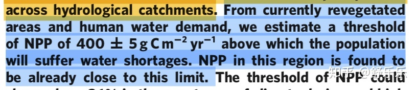*引文5 Feng, X. et al. Nature Clim. Change 6, 1019–1022 (2016).*

这是引文5最后的总结，大家自己翻译自己看吧。写的非常好，绝对是科学家的素养和科学的表述方式。

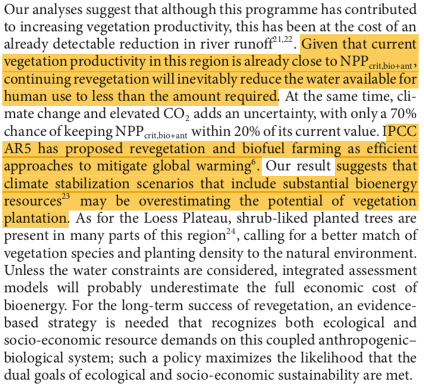

引文5结论(大意)：部分研究发现河流水少了。 现阶段种树已经到了承载力，再要绿化，就要仔细算账了。为保护当地环境，黄土高原很多地方已经开始种低矮灌木了。

引文6是投在HESS上，尚未发表仍在online discussion阶段，文章的第二个review（RC2）里面就和作者讨论了WRF模型能不能表达植被状况的问题，还对文章的结论提出了质疑。**引文6的作者的回复和修改2019年9月24日才发到HESS上，但是《Nature》的记者9月23日就以它的结论发表了这篇新闻。**

引文6做了非常艰难的模型模拟工作，工作量应该非常大。但就是论证的逻辑有点问题，第二审稿人很负责，提了很多意见。 尽管根据模型结果，在黄土高原，土地利用变化后，有的地方降雨增加了，有的地方减少了，但是投稿人认为作为整体降雨没有增加，所以结论也是没有增加降雨。 我觉得方法上都没有问题，就是科学解释上需要改善，第一要建立退耕还林与模型内土地利用变化之间的表征关系； 第二，总体上增减重要，但是更要分析空间上为什么出现不同变化，变化是什么因素造成的；第三，输出变量（气温、降雨、径流）和输入变量(气候驱动、土地利用、地形)尤其是土地利用空间特征之间的关系。 所以改一改文章要讨论的主题、梳理一下结论，这个会是篇很好的文章。


引文6审稿人意见之一：投稿人只模拟了每年的植物生长季，不是连续变化过程。 Tobella(2014)的研究报告植树对干旱区水资源有积极也有消极影响。投稿人的试验结果中降雨有增加也有减少，但是投稿人在文章中基本都坚持“没有增加”。

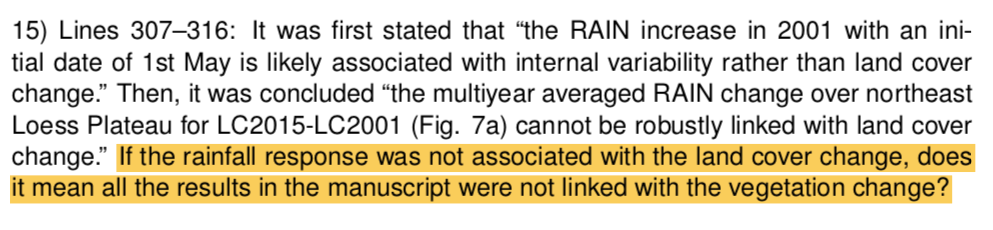*引文6审稿人意见之一：投稿人认为降雨和土地利用没关系。这个论断没有足够依据。*

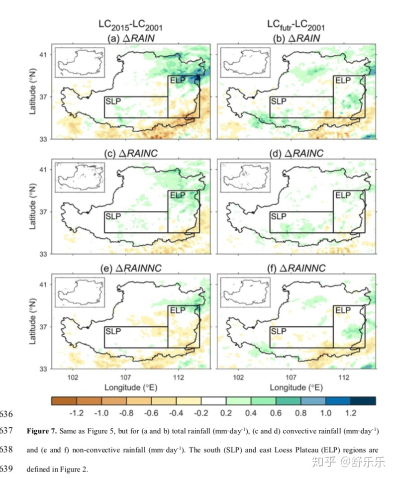

*引文6: 根据投稿人的结果，实际上部分地方降雨增加了，部分地方减少了。但是投稿人认为作为整体没有增加。*


总之，《自然》这篇文章涉及了种树、防沙治沙、气候变化、水资源短缺等等若干相关问题，但没有理清楚相互的关系。文章主标题针对的是单纯“种树”，副标题说的是防治沙漠化措施。两个标题说的是中国，但是几个支持论据是仅仅针对黄土高原的，把黄土高原的研究结论推广到整个中国的政策，显然不合理。另外，里面谈到的种树、防沙治沙、气候变化、水资源短缺之间的逻辑链条非常不完整，论据也不够充分，各种证据的时间点也都不一致。更要命的是各种证据是根据作者的想要表达的意思选取的，那些与其观点相反的研究内容并没有被提及。但上面涉及的科学家们的研究文章里面都有提及，科学家们的工作值得精读。

如果非要讨论种树的问题，我们可以参考引文1的图5。图上红色是森林扩张区域，蓝色是森林退化的区域。看得出来大部分的森林扩展发生在漠河-腾冲分界线的东南侧，也就是水资源相对充分的地区。其他几个文献提到的黄土高原的森林扩张面积几乎没有。

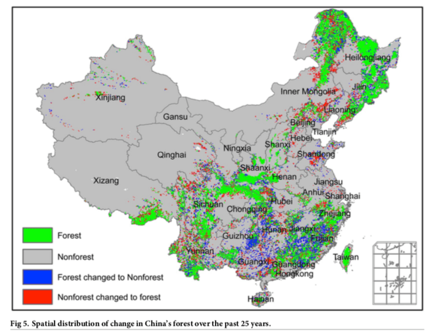

引文1当中的森林在1982-2006年间的变化。


再总结一下这个新闻里面引用的6个文献的研究，包括研究的时间段、研究区域和结论。

|       | 作者                          | 研究区   | 时间段         | 研究问题                 | 研究基础/方法         | 结论                                                         |
| ----- | ----------------------------- | -------- | -------------- | ------------------------ | --------------------- | ------------------------------------------------------------ |
| 文献1 | Lizhuang Liang(北京林业大学） | 全国     | 1982-2006      | 森林的增长的原因         | 遥感数据。归因分析    | 木材进口政策和经济繁荣是最主要的森林增长原因(占80%）         |
| 文献2 | 黄建平(兰州大学）             | 全国     | 1994-2008      | 沙漠化，沙漠化成因       | 气候数据              | 沙漠在扩张，由历史气候因素和人类开发活动引起。               |
| 文献3 | Remus Prăvălie(罗马尼亚）     | 全球     | 1950-2000      | 干旱区的变化趋势         | 全球干旱数据库        | 1980年后的全球气候变化是主要干旱化的原因；中低纬度最严重，未来可能到高纬度 |
| 文献4 | Fangyuan Hua （剑桥）         | 四川北部 | 2000-2015      | 森林的增长的原因         | 遥感和入户调查        | 森林增长32%因为退耕还林，但还是有6.6%原生林消失。未来要努力恢复原生林 |
| 文献5 | 冯晓明 (生态中心)             | 黄土高原 |                | 水资源对生态恢复的承载力 | 遥感+模型+CMIP5       | 现阶段种树已经到了承载力，再要绿化，就要仔细算账了。为保护当地环境，黄土高远很多地方已经种了低矮灌木。 |
| 文献6 | Jun Ge（南京大学)             | 黄土高原 | 2001,2015,未来 | 土地利用和气象的反馈关系 | WRF模型，土地利用变化 | 植被并没有带来降雨增加，反而蒸发增大了。(注：作者的实际结果是有的地方降雨增加了，有的地方减少了。而且这是模型结果，不是观测结果，对他的解读要谨慎) |

*6篇文献研究内容的总结*


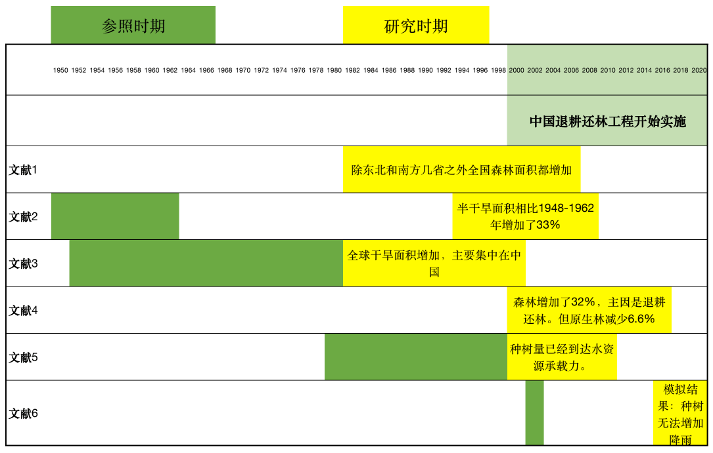*具体的研究时间段的总结。 这些研究时间段除了文献4和6之外，都不足以说明退耕还林后的情况——这是变化最大的时期。 而且文献6的研究范围仅仅针对黄土高原，文献4是四川情况，但作者想要说的却是全中国的情况。*


## **第二节： 究竟植树有没有好处。**

简单的说，**这个问题没有单一的、放之四海皆准的答案**。任何科学家的讨论都是基于具体假设和问题的理性讨论，但是并不适宜将单个结论放之四海。

植树造林涉及很多个面，有些好处是确定的，有些还需要进一步研究。

如下面这张图。

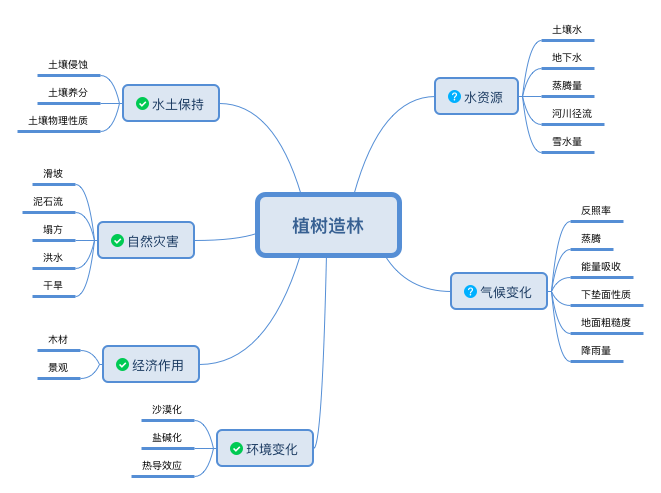

*植树造林的益处和尚有疑问的地方*


上图，左边都是基本确定是好处的内容。右边，是仍需要研究的内容。右边的内容有一些是植树造林有积极影响，有的是消极影响。但什么时候积极什么时候消极，要看具体问题和具体的研究区域。

我自己曾经的两个研究区域，科学问题是“土地利用对于水资源的影响”，一个在美国东北部，一个在中美洲，两个地方对于这个问题的答案是相反的；但研究内部的逻辑是一致的，就是水在自然空间的运动规律；将发现应用在这两个区域的时候，所采用的方法也是有区别的。

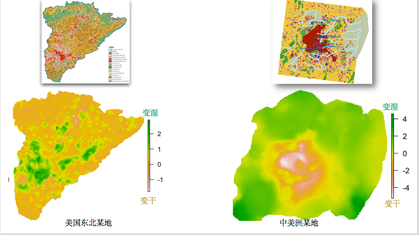*上面两个是土地利用图。红色部分是城市。植被覆盖不同，城市地区地下水变化结果是相反的——前者变湿润，后者变干旱。这和气候、城市位置、当地地形等等有关，物理逻辑是正确的，但是表象却不同。*

所以**单一的结论并不适用，不能解决复杂的自然问题，这一点在上面的每个科学家的文章里面都提到了。**事实上，中国在防沙治沙和植树造林政策上也并没有要求所有的确都统一种树、种相同树种、相同的维护模式，具体的操作都是根据当地状况而决定的。 降雨充沛地区、荒漠地区、盐碱化地区所种植的树种都是有区别的，比如巴单吉林沙漠的梭梭、部分三北防护林的高大乔木、塔里木等等的胡杨柽柳、西南地区的速生经济作物。我自己就是西部沙漠里面长大的，上中学(90年代末)每年都去压草方格和种梭梭，从来也没有听过在沙漠里面种树的。

具体实践中的错误很多。**对于中国现阶段的植树造林实践批评最厉害的应该是中央民族大学的曹世雄的四篇文章，非常激烈的批评，但是他具有科学家的素养，就事论事，针对不合理的实践作出的批评，指出为什么有些地区的人工种植植被的死亡率特别高，为什么现在的实践不算成功。他更多是指出这40年来的教训，但并没有直接否定整个植树的价值。**参考曹世雄老师2017年在科学网的一篇博客：[科学网-保护环境应不应该植树造林 - 曹世雄的博文](http://blog.sciencenet.cn/home.php%3Fmod%3Dspace%26uid%3D306645%26do%3Dblog%26id%3D1074315)

**科学家不盲目，盲目的只是有心的记者和没脑子的读者**。

## 第三节：几个扩展问题

1. **很多人都谈论一个很空洞的气候变化和自然环境，怕植树破坏来原有的沙漠自然环境。**

首先具体问题还是具体分析，比如西北的石羊河，黑河，和罗布泊等等，在不远的历史之前水量充沛，野生植被条件很不错，后来的沙漠化和气候和人类活动有关，植树就是人为修复了。这里面涉及的种树并不是大家想象中的高大阔叶林，而是当地的特有耐寒耐旱耐盐碱的树、灌木、多年草本。

种树本身也是考虑了当地的气候和水文条件的，比如在腾格里沙漠和巴丹吉林沙漠的植树，都是种梭梭，和红柳，耐干旱耐贫瘠耐盐碱。其他地方有使用柽柳和胡杨。这种植被的用水量非常低。 过去就在腾格里沙漠就以野生的梭梭、红柳、沙枣为主，后来逐渐这些野生植被死亡，沙尘暴加剧。 持续的沙漠化侵蚀村庄农田，当地人民种树压沙，也是保护自己的财产。

马前卒在某次《睡前消息》里面就提到，有些生态脆弱区域，应该让那些人民搬迁，减轻生态和资源的压力，给生态恢复让出更多条件。上面说的两个沙漠周围近些年人口都在减少。有一部分是生态移民的作用（至少始于15年前），退耕还林还草还牧，将水资源尚可的一部分土地恢复成自然植被，减少人类在缺水地区的耗水量。**减少人类的水消耗，转而分配给植被恢复，这是为了更大范围和更长远的生态环境。**

2**. 人为种树破坏环境和气候的自然状况，一旦到了某个临界点(Tipping Point)，植树就有坏处了**。

研究对于tipping point的问题不确定性很高，2019年有个《水文学未解决的23个问题》——是全球上百气象和水文科学家总结出来的。第一个就讲气候变化和水文过程的tipping point是否存在。Is the hydrological cycle regionally accelerating/decelerating under climate and environmental change, and are there tipping points (irreversible changes)? 这个问题还悬而未决。 Tipping Point的概念也值得讨论，如果有Negative Tipping Point，那么是否存在Positive Tipping Point；也就是irreversible的条件.

但是对于中国人而言植树造林的好处是显而易见的，我们传统上遵守一个原则**“坐而联想不如奋起华为”**。 让环境更适宜生产生活才是最主要动机，除了在水和气候问题上讨论植树的问题，应该也考虑到植树对于水土保持、抵挡风沙侵蚀、河道湖泊的演变、荒漠化、空气除尘、以更新森林为目的的造林等等的不同方面。这也是中央民族大学曹世雄的文章经常提到在植树中要慎重考虑的内容。

靠植树改变局地降雨量的影响确实是杯水车薪。不过对于减少洪峰、减少沙尘暴、改变水的时间空间分、改变水质、减少水土和养分流失方面的效果还是比较明显的。所以问题变成我们怎么定义植树的好处，应该期待什么样的好处，以及应该面临什么挑战什么代价的问题了。

新闻作者提到替代方法； @[iCer](https://www.zhihu.com/people/icerhe) 在它的答案种提到说绿化不应该适用单一树种，这个完全正确。实际上，这已经不是什么新发现了，早在20年前——真的就是20年前——我上大学的时候读过的一本书就讲过西南地区的植树都是单一树种问题，印象深刻的一句话就是“木+木 不等于 林”，森林是种生态系统，单纯的单一树木与森林的生态功能相去甚远。而且这也是国家一直在做的内容。2002年的《退耕还林条例》值得看一遍。上面反复提到了曹世雄老师的文章和博客都值得读，比网友和外国人理解得透彻。**但是很可惜《Nature》的新闻记者没有引用过曹老师的文章。**

**3 草方格如何阻止沙漠扩张？**

一部分评论都关注在“种树”的问题上了，我想也是被文章带偏了。我们来看看科研人员如何指导绿化和治沙的。有没有网友想象中的种高大阔叶树导致“植物是抽水机，会抽干地下水”的问题。

下面就是用草方格模式让沙生植物自我恢复的案例。

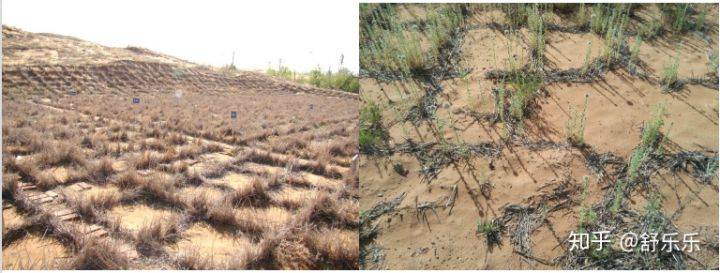

*“试验结果证明，１×１米大小、10-20 厘米高的麦草方格的防沙效果最好。不过，麦草方格在扎下4~5年后就会风蚀腐烂，需要重新补扎。下面我们看一张时间较为久远的草方格，我们可以看到破碎的痕迹，不过庆幸的是草本植物——砂蓝刺头已经成功入住这片沙地。”（来自沙坡头站的介绍）*

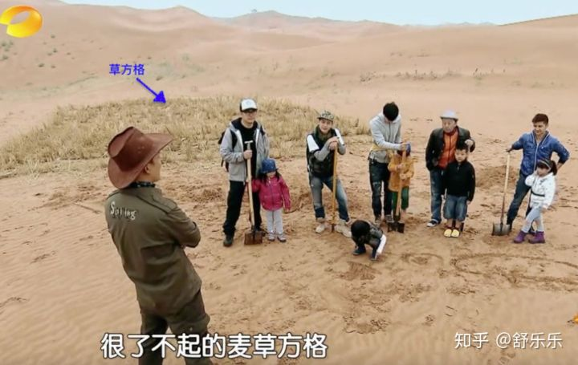

*2013年《爸爸去哪儿了》里面就有压草方格的过程，背后的沙坡上能看到天然的沙生绿色植被。草方格是沙漠边缘居住的人民都了解的便宜有效的治沙手段*

隶属中科院西北研究院对**草方格**和当地植物**砂蓝刺头**的生态作用有科学说明：

[草方格发明之问——宁夏沙坡头沙漠生态系统国家野外科学观测研究站spd.cern.ac.cn](http://spd.cern.ac.cn/content?id=36165)

[草方格和尼龙网沙障——宁夏沙坡头沙漠生态系统国家野外科学观测研究站spd.cern.ac.cn](http://spd.cern.ac.cn/content?id=36196)

[3月破土，11月仍生长，砂蓝刺头堪称最勤劳的“沙漠卫士”spd.cern.ac.cn](http://spd.cern.ac.cn/content?id=39976)


## 第四节：如何写才靠谱。

1. 先把配图的字改一改。说是Tree-Planting，其实是防治沙漠化的草方格。
2. 说清楚是要讨论植树造林，还是沙漠化防治。这两个内容是不一样的，措施不同，所以面临的问题也不同。
3. 说的究竟是中国还是黄土高原。如果是中国，那么就要考虑全国不同的确的自然条件和实践方法的变化，要得出来单一结论是非常困难的。文章证据集中在黄土高原，那么题目就要改成黄土高原了，要说清楚黄土高原的问题，相对简单了。
4. 文章叙述了中国植被变化的几个数据，但是没有引用最新的NDVI数据(波士顿大学Chi Chen的文章)，上面记录最新的世界各国植被变化状况。
5. 与其观点相反的研究结果也应该引用，比如《科学》上Yue Li(2019)。还有些重要研究应该参考到《自然》马里兰大学Xiao-Peng Song(2018)，《自然》Chi Chen(2019).
6. 数据和证据的时间线要连续。比如1948-2000是环境损害最严重的时期，在那之后无论是防治沙漠化还是恢复青山绿水的植树造林活动都更积极，重点比较这两个阶段的效果和环境影响，就可以说明一个科学问题了。
7. 主标题说的是未来气候变化，那么证据种需要寻找未来气候带来的降雨气温变化与植物、水环境的链接关系。现在的文章里面说的气候变化大部分是历史气候变化。
8. 这是个极其复杂的问题，只关心植树对水资源的影响就敢说那么大的两个标题，也是心大。 其中涉及经济、生态、灾害、水土保持、气候反馈一系列因素，如果没有打算都讲讲，最好是起个更具体更细节的标题。

下面这个视频是我用遥感数据处理后的2002-2017年间全国NDVI的逐月变化，上面打了我的水印（有想合作研究的请直接联系我）。NDVI可以表征植被的覆盖率、植物生长状况，越绿植物状态越好覆盖率越高。 左上角的绿线是全国每月均值，红线是趋势，有明显的上升趋势，尤其是2010年以后。前面的被引用的研究很少涉及这个时间段。相比之下，同时间段，美国就没有类似的上升趋势——不过美国人家降雨丰富天生的森林条件就比中国好。

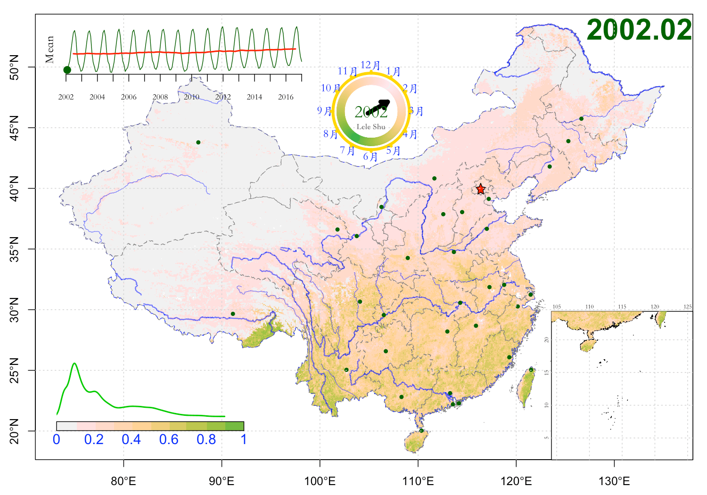

2002-2017年间中国NDVI变化


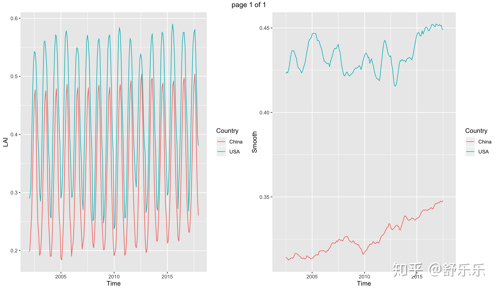

*2002-2017年逐月全国NDVI的均值逐月变化，中国对比美国(本土48州)，左边逐月，右边趋势。中国NDVI过去16年明显的上升趋势。 美国天生的自然条件就比中国要好，尽管中国很努力的改善自然环境，但是依旧赶不上美国。*

```text
上面的视频和下面的图都是直接用R代码做出来的，处理数据、投影、出图、生成视频，一气呵成。
代码在个人网站：https://www.shulele.net/en/post/20191003_r_animation/
```

\~~~~~~~~~~~~~~~~~~~~~~~~~~~~~~~~~~~~~~~~~~~~~~~~~~

**我很奇怪为什么这篇文章上了《自然》， 更奇怪为什么一帮外行点赞，更更奇怪为什么我的若干同行没有看文章没有看引用的文献就开始大发议论。**

文章太长了。生态恢复是一个极为复杂的问题，如果不从各个角度解释和证明，很容易给别人留下攻击的漏洞；凡是我说出来的话，必然要有点证据。 纵然很努力，但里面还是缺少几个重要的证据，如果我能力再强一点的话，补充一下**全国不同地区的情况、最新的气候变化情况、更详细的实践规章制度和统计数据**的话，能更好的证明对方的片面性；同时更好的给公众解释这个复杂问题，让公众放心——科学家们正在为我们的未来保驾护航。 所以大家也能看出来，这的确是一个非常非常复杂的问题，即便是科学家也很难全面解释和预测。我正在集合几个领域专家一起写个论文从各个角度阐述这个问题，祝我成功。

文献信息都在评论区里面。5K赞的时候，我把文章的语言基调大改了一次，现在基调是少带个人情绪，多往积极方向理解每个作者。

**更新一句：**我见到了几位科学家给《自然》记者的采访回复。我知道记者对科学家的原话做了裁剪。不知道有心还是无意，总之新闻记者叙述的意思和科学家们非常谨慎严谨的表述是不一致的。 暂时还没有科学家们授权，我无法展示细节。

**最后一次更新**：我写了篇短评给《自然》，2019年12月31日正式发表，[China’s different shades of greening](https://www.nature.com/articles/d41586-019-03940-3)。因为对方只允许300字以内，我很尽力了，但一篇短评无法把问题说清楚，只能究其一点讨论。等我以后找合作者再写个长的综述吧。

引用几句话来总结吧：

1）**科学家不盲目，盲目的只是有心的记者和没脑子的读者**。

2）**听蝲蝲蛄叫，还不种庄稼了？**

3） **与其坐而联想，不如奋起华为**
