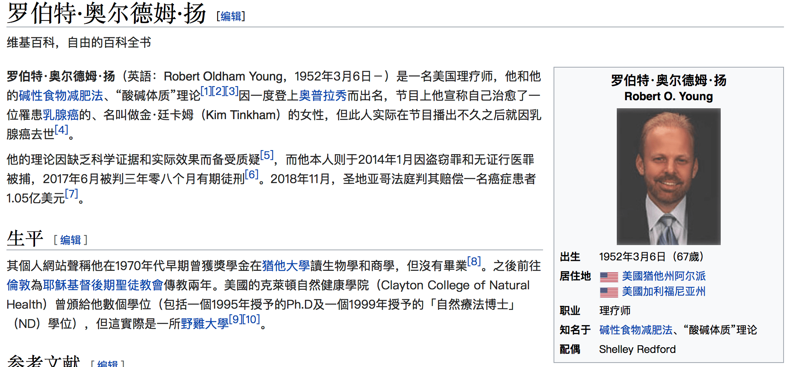
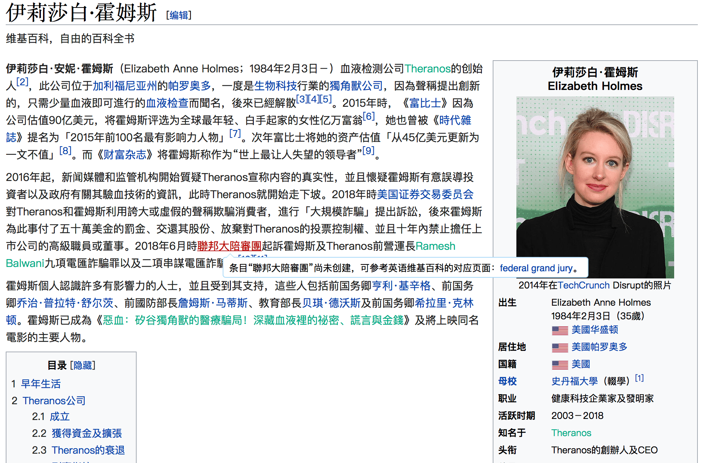
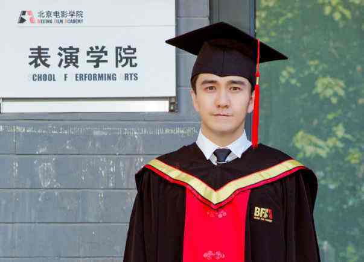

**我经常在想，金庸笔下的挥刀自宫究竟是什么意思？**

金庸笔下的江湖。并不是一个空穴来风的虚构世界，而是将现实社会抽象化之后的江湖。金庸笔下说的江湖说的每一个门派、每一个大侠、每一个普通人，在我们现实中都可以找到类似的例子。

在金庸笔下，江湖中有若干绝世武功，都可以通过艰苦卓绝的努力而成为一代大侠。比如，岳不群说的紫霞神功，比如风清扬的独孤九剑，比如黄药师的九阴白骨爪，比如武当山的九阳神功。这些都是绝世武功，但想要获得这样的绝世武功和成为一代大侠，一需要有名师传授，二需要刻苦练习的毅力，第三还需要有天赋，有悟性。所以这些条件限制了一个人获得成功、获得绝世武功的能力。
青城山的余沧海，塞北明驼木高峰，君子剑岳不群，嵩山左冷禅，他们都没有这个啊，机会、毅力、条件通过这条路径获得他们想要的名和利。于是他们想获得一个可以获得绝世武功的秘籍，这个秘籍并不需要名师指导，似乎也不需要刻苦练习，只需要获得这个秘籍就可以获得成功，他们都走上了追求武功秘籍的道路，放弃了勤勤恳恳而获得成功的途径。

那么，什么是挥刀自宫呢？
江湖中每一个人都有武功门派，也都有师傅指导，只要通过自己艰苦努力，或多或少总会进步，也有机会获得更大的成功，也可能成为一代大侠，比如天资并不聪明，江南七怪的徒弟郭靖。但是这样的过程，需要艰苦的努力，需要很长的时间，甚至还要赌上一些运气。并不是每一个年轻人都愿意走这一趟充满不确定性的艰苦道路。
对成功的渴望，与现实的焦虑压迫着每一个江湖中的人。于是有的年轻人——甚至是门派掌门，就开始思考用其他更简便易行、离经叛道的方式来获得他们的名利。他们首先相信一点要获得成功，首先要获得《葵花宝典》或者《辟邪剑谱》这样的绝世武功典籍。他们相信，获得《葵花宝典》和《辟邪剑谱》是传说中的人物成功的基本条件。于是他们千方百计要首先获得剑谱。
于是江湖中有很多人都拿到了《葵花宝典》和《辟邪剑谱》。比如百年前华山派、魔教、任我行都拿到了《葵花宝典》，但是魔教、华山派、任我行都没有真正修炼这部剑谱，为什么？那是因为《葵花宝典》的开篇第一句是“**欲练神功，必先自宫**”。
为什么会拒绝挥刀自宫呢？因为挥刀自宫就意味着要放弃自己，要放弃作为人所最基本的那些东西；放弃了自己对自己的认同，也放弃了自己底线的底线。在金庸笔下，一个人若能够若敢于挥刀自宫，那么人世间一切的亲情、恩情、正义都不存在都不重要。只要你敢挥刀自宫那你就放弃了，除了名利之外这个世界上一切的东西。

那么现实中，谁是那个挥刀自宫的人呢？
在学术界那些剽窃、抄袭、篡改数据、篡改结果的人，不就是挥刀自宫的人吗？选择舞弊的人，首先放弃了通过艰苦卓绝努力而获得学术进步和影响力，而选择那种最轻易，却不道德的方式，来获得他所想要的名利。当一个做学术的人，愿意抄袭的时候，也就放弃了作为学术工作者的底线。

在学术界那些剽窃、抄袭、篡改数据、篡改结果的人，不就是挥刀自宫的人吗？放弃了一个学术人为学术人的最基本底线，当然，这样的挥刀自宫，可以获得成功可以发表很多文章，可以发表重要文章，一段时间成为一代学术上的武功高手。 但是和那些真的拿起刀子切鸡鸡的人一样。这样在学术上挥刀自宫的人，同样不会再有后代——他如何去教他的学生，他的门徒重复和他一样的实验，发一样的论文？
当有一天，那些挥刀自宫的学术工作者发现竟然切了鸡鸡，那他就丢尽了脸面，人人都知道他是没有底线的败类。那未来他在学术的江湖中，人人都会躲着他，唯恐与他有任何瓜葛，他在学术界将无立锥之地，他将会被人唾骂，遗臭万年。
现实中想成为学术大侠和江湖中的武功大侠一样，需要艰苦卓绝的努力才可获得。但时常艰苦的努力，并不能让你心想事成，但是挥刀自宫却可以让你轻易获得那份忐忐忑忑的荣耀。

**《葵花宝典》放在你面前，你愿意挥刀自宫吗？**

我知道这世界上有人愿意，比如他们：

