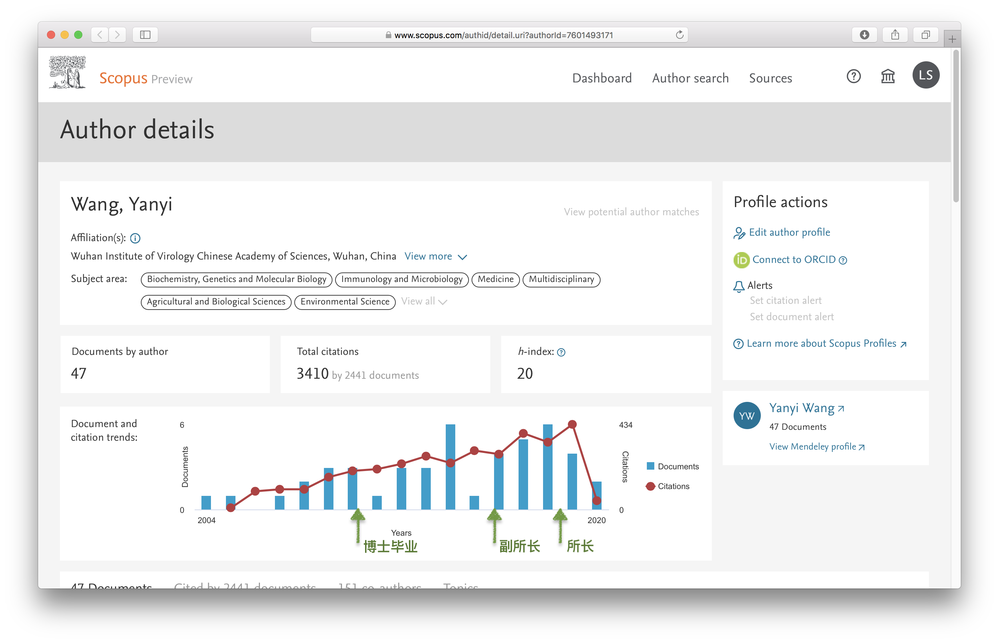
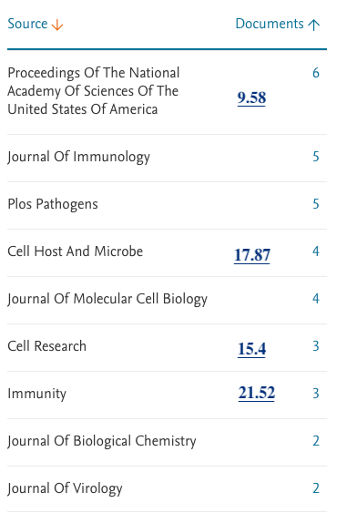
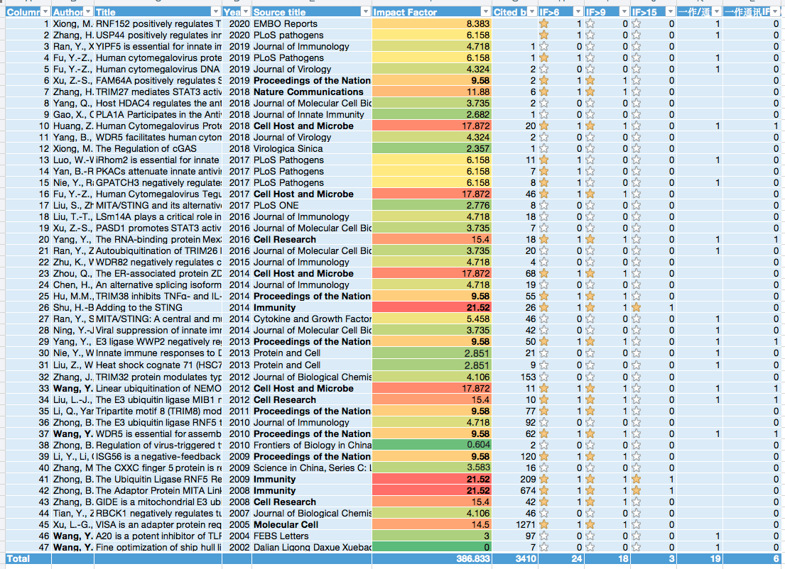
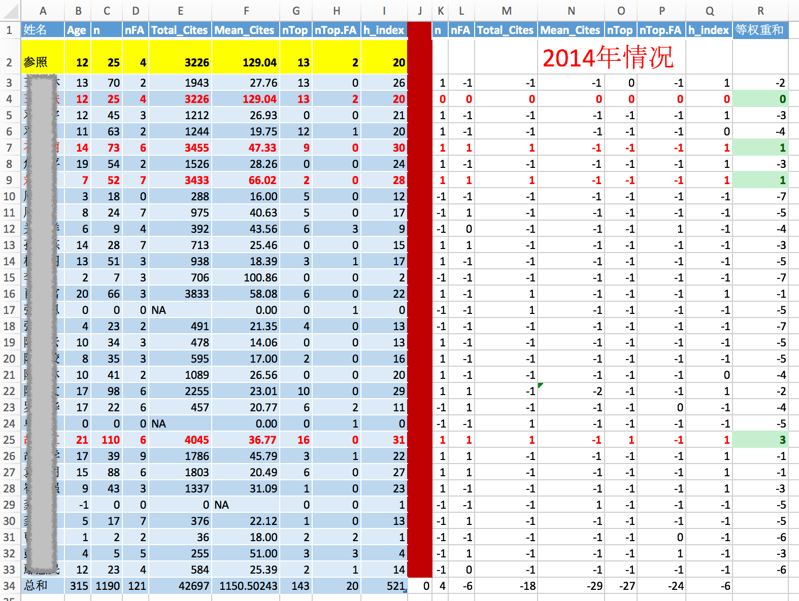
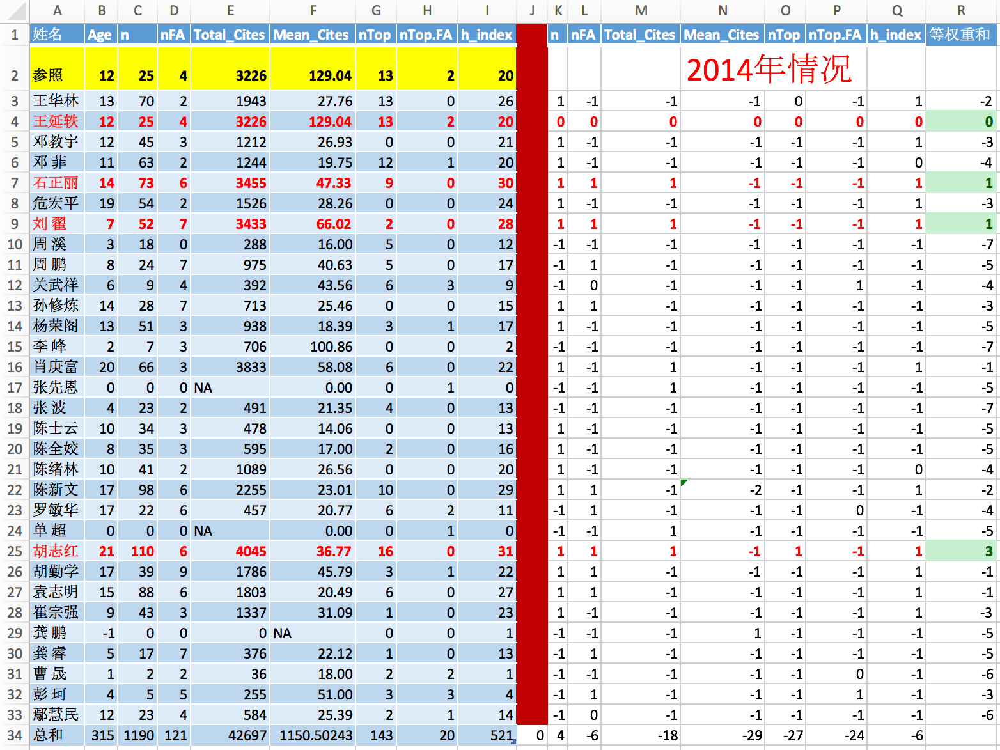
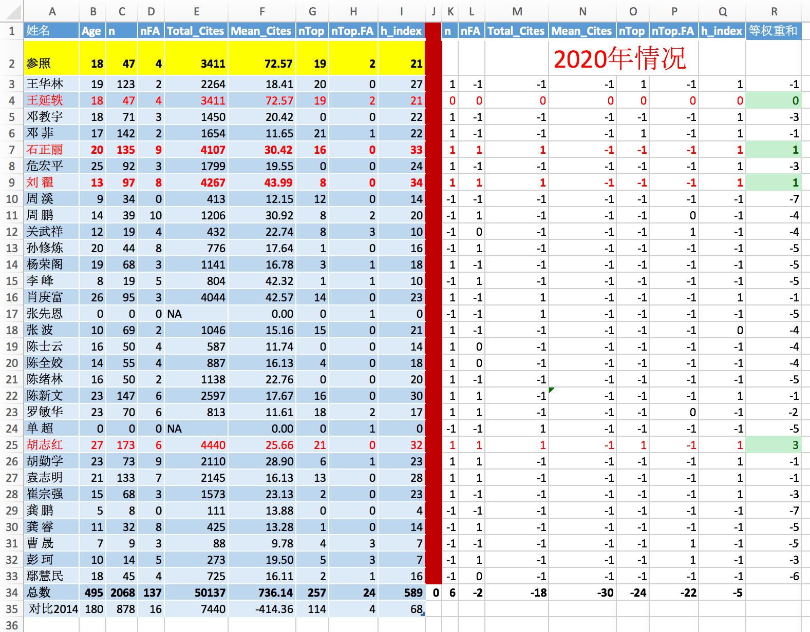
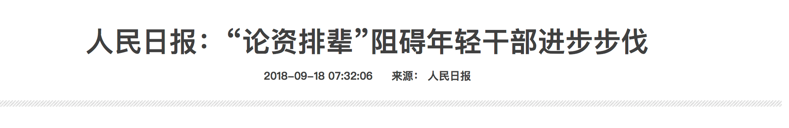
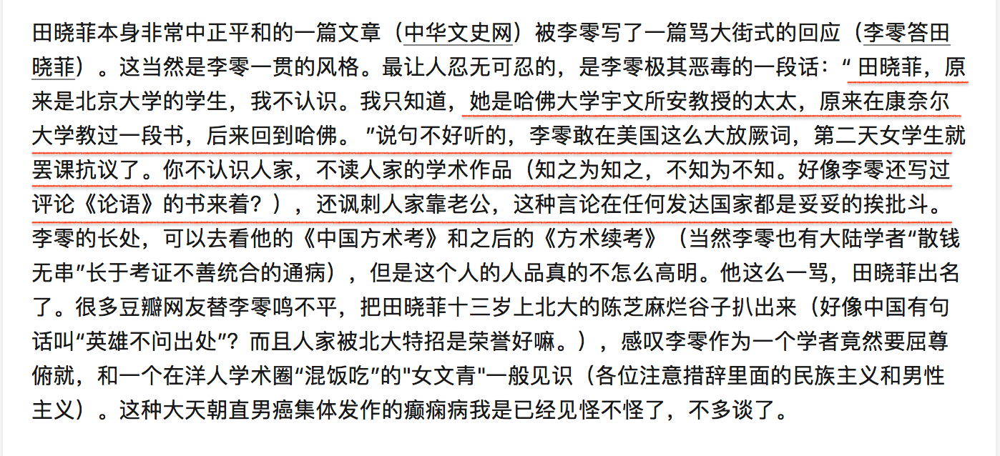

现在几个批评文章意思差不多，基本主旨是这样：

> 1. 学术能力不够，却当所长。证据：只有24篇文章，11篇通讯文章，说不够分量。
> 2. 年龄太小，资历不够。 证据：1981年生，2005年大学毕业，2010年博士毕业。
> 3. 王延轶和导师舒红兵是夫妻关系，上位过程都是靠她老公。 可能是大学一毕业就确立了夫妻关系。
> 4. 给了一个“双黄连之母”的标签。

我逐条批驳。


## **第一条，文章数量**

真实数据：**47篇文章，18篇是顶刊(PNAS及以上期刊)。19篇为一作或通讯作者，19篇中，6篇为顶刊。**

### **1.1 她的文章本身并不差。**

请看SCOPUS上对她文章的统计：[Author details (Wang, Yanyi)](https://www.scopus.com/authid/detail.uri?authorId=7601493171）

||
|:--|
| SCOPUS上的数据，标志了重要时间点|

王延轶个人网页**自述**有28篇文章（一作、通讯、N作）引用1700；实际数据应该是47篇，引用3410次。有三个文章数：24， 28， 47，分别来自病毒所介绍、批评文章和SCOPUS，SCOPUS数据更新最快，应该以此为准。**朋友圈的批评文章有意还是无意采用的是百度的页面，24篇**，不知道是那一年的数据了。


||
|:--|
|*顶刊有：6篇PNAS, 4篇Cell Host and Microbe, 3篇Cell Research，3篇Immunity，图上缺一篇NC，一篇Molecular Cell。一共18篇大于9影响因子的文章，PNAS刚好就是9.5，所以我选9作为阈值。*\


批评文章里面说她作为通讯作者只有11篇，她作为导师尤其是中科院的导师，因为中科院的学生数量少，所以11篇通讯文章已经不少了。**实际上她一作和通讯一共有19篇**。

拿科学院研究的文章数量和任何一个大学同级别教授比较，科学院都要输——因为**科学院学生数量少**。

||
|:--|
|*scopus下载的详细数据， 到2020为止。后面影响因子是我查询的数据*|


**我们一边批评学术评价体系只看发文章的八股式科研制度， 同时又以文章数量少来批评或者指责一个人学术不合格。即便是做吃瓜群众也不可以这么双标吧——何况人家的文章不少。**


### 1.2 看她在参照系中的位置**

另外要注意，武汉病毒所其他几位领导的文章数量也都不高(链接：[现任领导](http://www.whiov.cas.cn/jggk_105204/xrld/201312/t20131227_4006476.html))，唯一数量比她高的是党委书记，肖庚富(1966年生)，60篇文章(简历自述，和SCOPUS差异很大)，h-index 22, 总引用4000. 所以从同行数据来看，党委书记和所长都是同级别水平。

| 参照系 | 职位                     | 文章数量       | h-index | 同行引用 | 顶级期刊              |
| ------ | ------------------------ | -------------- | ------- | -------- | --------------------- |
| 王延轶 | 所长                     | 24/(47 scopus) | 20      | 3410     | PNAS， Cell, Immunity |
| 肖庚富 | 党委书记、副所长         | 60(自述)       | 22      | 4034     | Lancet， Autophagy    |
| 何长才 | 副党委书记、行政副所长   | -              | -       | -        | -                     |
| 龚鹏   | 副所长， 百人计划        | 6*             | 1*      | 27*      | PNAS， J Virol        |
| 关武祥 | 副所长                   | 17             | 9       | 411      | J Virol.              |
| 陈新文 | 前所长                   | 145            | 29      | 2563     | NC,  等               |
| 胡志红 | 前前所长                 | 171            | 31      | 4436     | 未知                  |
| 陈全姣 | 研究员                   | 55             | 17      | 886      | Cell, J Virol         |
| 邓菲   | 研究员                   | 40(自述)       | 21      | 1653     | 未知                  |
| 彭珂   | 研究员                   | 48*            | 9*      | 394*     | 未知                  |
| 王华林 | 研究员，**万人计划2017** | 40(自述)       | 26      | 2263     | J Virol.              |
| 罗敏华 | 研究员                   | 68             | 16      | 811      | NC,  NN, J Virol等    |
| 周溪   | 研究员，实验室副主任     | 20(自述)       | 13      | 413      | Immunity, Cell等      |

*表格1: 武汉病毒所领导和研究员的参照系。研究员的数据是随机找了几个，不是全部研究员数据。 行政副所长何长才的数据没找到。打星号*是因为数据值太低，不可靠，可能是SCOPUS数据跟踪出了问题。 欢迎验证以上数据。凡自述的文章数量都可能是被低估了。*


**我专门写了程序从SCOPUS上获取了病毒所所有博导的文章发表情况——源代码和结果数据会上传我个人网站，供大家检验。** 博导名单来自武汉病毒所网站**：**[武汉病毒所导师介绍](http://gd.whiov.cas.cn/dsjs/201410/t20141013_261889.html)

**时间回到2014年——王延轶2015当所长——她的能力和同行相比如何？**

请告诉我从下面的这张表格里面，隐藏了名字，你觉得谁比较合适当所长？ 红色字体行是计算出来各方面比王延轶高或者刚好相等的。 黄色第一行是王延轶的指标，作为参照。

||
|:--|
|*表头分别是学术年龄、文章数、引用数、平均引用数、顶刊数、一作顶刊、h因子。 红线右边：与参照值的比较结果，大于=1，小于=-1，等于=0. 最后一列为等权重和。*|


那我揭晓答案：

上面有四个人比参照系高，**王延轶本人， 石正丽，刘翟，胡志红**。

石正丽——微生物分中心主任。 这两天也正被人讨伐，也委屈着呢。

刘翟——**2017**年才进入武汉病毒所，之前在中科院大学。

胡志红——**前任所长。**

现正被网友鞭挞的两个人，**王延轶**和**石正丽**正好是2015年最合适当所长的两个人，怎么样，你瓜掉了吗？ 我看了石正丽的数据，她也是很牛，如果她当所长，我也没有意见。


 |
|:--|
|2014, 展示名字 |


**再看最新的2020的数据。** 是不是还很惊讶？ 排名靠前的人无论是6年前还是6年后，都是靠前。

||
|:--|
|从最后对比2014年的数据看，这六年武汉病毒所的各项数据都大幅前进。|


**隐去名字的时候，你更容易判断谁合适当所长**。因为你看到他们名字的时候经常脑补了什么东西。

### **1.3 对比外国的参照系**

我说这些数量吃瓜群众肯定不服，因为吃瓜群众听说过有发表更多文章的教授，他们并不是系主任，并不是所长。

群众认为——很多科研工作者也认为——只有那一年发表10来篇或者几十篇论文的教授才是好教授。但是真是这样吗？**我们真的需要发那么多文章的教授吗？**

我统计过美国前131所大学R1大学（最顶级研究型大学）12,000个近5年新入职教授的文章发表情况。

1. 美国助理教授的h因子(h-index)，平均10左右。 95%的教授都低于23。王延轶20, 已经高于美国新教授的这个平均水平。
2. 看总引用次数，王延轶有3400个引用数，但是12000个美国R1大学的助理教授的平均数字是1000上下。
3. 王延轶的引用数和h影响因子都高于美国R1大学助理教授的平均数。
4. 王延轶的所发的文章中有18篇顶级期刊，其中6篇顶刊是一作或者通讯，一作顶刊两篇。

我们究竟要追求质量还是追求数量？我们的吃瓜群众一边批评中国科研在不停的灌水，灌很多没用的文章，一边又说一批科研人员发的文章太少，这不就是双标吗？像她这样高引用和高h-index的研究者，我们应该是称赞才对。

网上有评价袁隆平是没有什么文章但是真国士。评价屠呦呦也是没有什么文章但不妨碍她成为国家最顶级的科研力量。我不是说王延轶一定是袁隆平和屠呦呦这样的科学家，我只想告诉吃瓜群众，**不能只看文章的数量，来评价一个科研人员**。这也是我一直以来想要送给中国科研政策制定者的最重要的衷告。

> 我需要解释一下我做的美国数据。
> 数据是美国的助理教授，不是正教授。吃瓜群众应该不服：**一个美国助理教授级别的人怎么可以当中科院病毒所的所长？**
> 一个可悲的现实：一个可以在美国R1大学拿到助理教授的人，在中国都通常是在青年千人以上级别的人物。大家去看看历年青年千人中，有几个是已经在美国拿到助理教授的人？我认识大概50个青年千人，没有一个是R1大学助理教授级别的人，都是低于助理教授——博士后、大学研究员等等。我知道的只有一个是美国的助理教授后来评上了青年千人，这个教授所在的大学还不是R1，没有进入前131名。
> 所以我在此忠告每一个吃瓜群众和标准制定者：我评价科研工作者的工作，不要只看文章数量。因为如果只看文章数量，绝大部分中国的科研工作者都高于美国顶级大学的教授。我们应该认真的看她的研究工作，对我们的社会经济文化是不是有真正的贡献、是不是对人类认识和改造自然提出了新方法新认识。 如果真的要只看那些指数，请看h因子——尽管H因子也不完美。
> 我们大部分的教授文章数量远高于美国教授，但是我们的引用数远低于人家，这也是为什么我们科学界一直流传中国的科研都是在灌水的主要原因。也就是说尽管发了无数文章，但你的研究对于其他科学家是没有价值的，所以同行不会引用你的文章。

也有人疑问：她可能做一个教授是合格的，但她怎么可能合适做一个所长呢？

### **1.4 她合适做所长吗？**

前面列举了病毒所2014年的文章发表情况，唯一可以和王延轶竞争的是石正丽，至于他们俩谁应该当所长，我也不知道。

我们经常说学习外国先进经验，那么外国的所长和领导的任职制度，是不是也是应该学习的一点呢？我们经常觉得我们的官僚不够合格，外国的都好，那么我们介绍一下外国的系主任都是什么情况，

我上博士的宾州州立来说，我们系是美国知名工程专业。我见过两任系主任。现任系主任影响因子34，引用数5000， 但是这个老师的学术年龄是35左右——也就是35年的学术成就。前任系主任，学术年龄也大于30，总引用数1100。而且影响因子只有14。这个学术是系主任的背景，但要考虑这两个系主任都是学术年龄大于30。

| 参照系                | **h-index** | **引用数** | **学术年龄** |
| --------------------- | ----------- | ---------- | ------------ |
| **王延轶**            | 20          | 3400       | 15           |
| 美国R1助理教授平均    | 10          | 432        | 12           |
| 美国R1助理教授90%比例 | 21          | 2405       | <22          |
| 美国系主任1           | 34          | 5100       | 30+          |
| 美国系主任2           | 14          | 1100       | 30+          |
| 美国系主任3           | 65          | 11000      | 30+          |

*表2: 王延轶 vs.美国R1大学助理教授和美国top50大学系主任（google scholar数据）*

当然，如果我们拿顶级的匹兹堡大学（免疫学科、顶级）的系主任，h影响因子是65， 总引用数超过11,000个。高山仰止啊。但是学术年龄也接近35。

**问题来了：如果拿这匹兹堡大学系主任免疫学科系主任的标准给中国大学和研究所招聘领导，请问你觉得你付出多少年薪和福利人家会来？**

*参考答案：上面那个匹兹堡大学系主任9个月的薪水是40+万美元，其他类似系主任和教授9个月薪水也是40-65万美元。不包括其他福利。*


外国大学的系主任通常研究任务比较轻——拉关系、找经费、维护与其他学校机构关系是美国系主任的主要任务，**科研不是第一要务**。回归刚才的问题，我们应不应该学习外国这种模式，潜台词是外国这种模式是否先进？

退一步说，美国这种轻研究重社交的系主任模式有没有什么错误，是不是一种学术舞弊或者学术不端？如果不是，那么以王延轶的科研实力背景来做这个系主任，也不应该有什么问题。

## **第二条，年龄**

第二个批评是王延轶的年龄。1981年出生，现年39，四舍五入40岁了。现在有很多的大学院长和系主任也都是这个年龄。很佩服这些年前有为的人。

大家参考上面列举的的武汉病毒所的研究员，年轻人居多，而且年轻人的研究引用是超过年长的研究者的。70末和80后的研究员各项数据都明显高于之前的研究者，这是我们发展阶段的特有现象。

**前面表格中，各项指标都高的几位研究者都很年轻（王延轶、石正丽、**刘翟**），如果年轻是个缺点，我们只能让那些年长，但科研指标差的人来领导。**

我们国家和政府一再强调，让党员干部年轻化，让愿意接受挑战有干劲的年轻人，担当重任。当政府说要给党员干部年轻化的时候，我们的年轻人，我们的网友都是支持这个政策的；认为年长的人已经腐朽不化，跟不上时代，所以需要年轻人来担当大人，这不正是好事吗？不正是我们所希望的吗？为什么到了王延轶这里我们就要反过来说，因为她年龄不够，拿她的年龄和其他一些年纪大处高位的人来对比呢？

如果我们不能证明她的能力有不足，那么我们在这里就不应该质疑她当所长的年龄太小。




## **第三条，师生夫妻关系**

他们的婚姻发生于**10几年前**。

只要没破坏对方家庭、没有老师逼迫学生、学生勾引老师的情节——至少现在的质疑文章没有能够提供这些证据——那我们就不能说她的夫妻关系有什么值得我们去指责的地方。

除师生关系之外，主要的质疑是他们的夫妻关系是不是导致了学术不端。正因为王延轶是舒红兵的学生，所以当王延轶发表文章时，舒红兵必须作为通讯作者。如果你觉得夫妻不能是研究生和导师的关系，那么你也不应该指责他们，而是去找北京大学和武汉大学。

**只要她没有学术不端，没有抄袭剽窃伪造数据篡改数据，那就是正常的学术发表。**

没什么数据分析能力的人说王延轶的文章“都是老公的通讯文章“——我们网友中从来不却此类不分析数据不找证据瞎说的所谓行内人。 前面引用数据是scopus公开数据，2014年之前，尤其2012年以前很多文章是舒红兵通讯。有人质疑当所长之后的文章也都是舒红兵的通讯，实际数据是2014年以后一共22篇文章，只有5篇是舒红兵通讯，2篇有舒红兵的名字。 2014前有很多舒红兵的名字。

夫妻任职同一个院系，夫妻共同参与一个项目，夫妻共同发表文章，这样的案例再中外都很多，从助理教授到院士都有。 美国大学通常为了留住一个好教授会努力将其配偶也招为教授，这种美国模式你可以叫作举贤不避亲，也可以叫作近亲繁殖。 我之前列举了美国几对同专业同学校夫妻档教授的文章，他们大概有1/4到1/3的文章有其配偶的名字。大家似乎直接无视了这个数据。

不得不说，**师生恋在舆论中是有原罪的**，任何师生恋/夫妻档如果不能在成就上高出同辈很多很多，都会被同辈用这个弱点攻击。

**师生又夫妻又同专业**的还有**哈佛教授田晓菲**与***宇文所安\***（Stephen Owen），公开资料田晓菲的博士导师是宇文，1998年博士毕业1999年1月1日结婚。 这两个人年纪差别多大？ 宇文1972年博士毕业；田晓菲1971年才出生，1998博士毕业，**年纪差别26岁**上下(王舒差别14岁)。 1998年毕业，1999年1月1日结婚，1999年哈佛讲师；2005年哈佛副教授(终身教授)，跳过了助理教授；2006年哈佛正教授。 8年时间哈佛正教授，算不算火箭上升？ **2009**年哈佛大学东亚地域研究院主任。 **我举例不是说田教授有问题，我只是给你提供相似案例。**

这两个哈佛夫妇也被中国某教授指着骂呢。参考这两个[知乎问题](https://www.zhihu.com/question/22294757/answer/162761560)

和[豆瓣：转个天涯的：818田晓菲](https://www.douban.com/group/topic/21811488/)




=====重要补充========

**有些没有见过外国的人总是幻想着一个完美无缺的外国。**

我发现大家幻想中的美国都是坚决禁止任何教授和学生恋爱和性关系的。我还是给你看研究数据吧。

```text
研究文章：Richards, Tara N., et al. "An Exploration of Policies Governing Faculty-to-Student Consensual Sexual Relationships on University Campuses: Current Strategies and Future Directions."Journal of College Student Development, vol. 55 no. 4, 2014, p. 337-352.Project MUSE,doi:10.1353/csd.2014.0043.
```

文章调查了55个美国大学对师生性关系（**Faculty-to- Student Consensual Sexual Relationships** ，师生合意性关系）政策，分析以下5项内容：

1. **师生性关系的接受度。研究结果：**仅仅只有一所大学（耶鲁）明令禁止；82%的大学是认为师生合意性关系在特定条件下不合适，比如导师、授课、同专业。15%的大学劝阻(discourage)此类关系，**但操作中，完全接受师生性关系**(but at the same time, in practice, fully accept consensual sexual relationships between faculty and students)。但警告，如果这个关系被起诉成性骚扰，就得吃不了兜着走。
2. **明确师生不平等关系**。98%的大学承认师生天生不是平等关系，并导致学生一方在此关系中受屈。36%的大学没有区分本科和研究生在此关系中的区别。部分大学允许手段规避这个利益冲突，例如加州大学伯克利允许换导师、调离现任岗位等等。
3. **师生性关系中学校的告知责任**。 研究结果： 38%明确告知教授学校此类相关政策和此事风险，62%没有明确告知。
4. **是否要求向学校报告**。研究结果：44%的大学明确要求报告，56%的未说明。
5. **是否有惩罚条文**。 研究结果：51%大学有明确违规处罚办法，剩余49%没有。例如UT Austin规定，违规(未明确是违反了‘没能报告“还是”发生关系“哪个规则)最高可能导致开除。北密歇根的惩罚是”口头警告到开除“。 有些大学的惩罚措施非常模糊。

**以上是巴尔的摩大学2014年的针对美国55所大学现状的研究结果，这是不是你们想象中的美国？ 严禁师生恋爱的美国？**

**StackExchange上面问我能不能和研究生约会的问题，回答者给了若干案例：**[Is it ethical to date a graduate student of the same university where you are a faculty member?](https://academia.stackexchange.com/questions/104841/is-it-ethical-to-date-a-graduate-student-of-the-same-university-where-you-are-a)

(这一小节仅仅是因为好多评论说美国好，美国禁止师生恋， 我给大家展示一下实际的外国)

**===========================**

## **第四条，双黄连之母的标签**

双黄连的事情人家一开始就说得很清楚是“抑制”，人家没有说错。网友说那油盐酱醋也有抑制作用，这也没有错。 这就是民众如何看待科学研究的问题了，也是一个科研结果如何向公众展示的问题了。

曾记否那些年都说“**都说百年一遇，为什么我活了20年，却遇见了这么多的百年一遇？**“ 人人都说是政府和媒体推卸责任才说”百年一遇“这种不合逻辑的话。我后来科普了这个问题，再后来此类蠢话就少了。请搜索“百年一遇”。

在大家大力指责双黄连的时候，另有一个研究却被捧上了天——remdesivir。这个药物的临床观察样本**只有1个**，尚在试验当中。但却被朋友圈和若干号称医学专家的号给描述成唯一可靠的药物。 在这个层面上，remdesivir和双黄连是研究阶段的中间状态，**都不足以证明是有效治疗或预防药物**。

但就网友一边冷嘲热讽双黄连严谨表达的“抑制作用”，一边极力推崇只有一个临床试验样本的remdesivir——你能判断这一个样本是自愈还是药物作用吗？当吃瓜群众也不能随意双标，是不是?

我引用科技袁人的原话：

> 2月1日，《新英格兰医学期刊》也报道了一种有希望的药物（[NEJM重磅：美国首例新型冠状病毒感染者使用新型抗病毒药物后退烧，病情好转丨临床大发现](https://mp.weixin.qq.com/s%3F__biz%3DMzA4MjA2MDI5OQ%3D%3D%26mid%3D2659488448%26idx%3D1%26sn%3D182031ab71c27b105dd2a8d1d56ec478%26scene%3D21%23wechat_redirect)）。美国确诊的**第一例**新型冠状病毒患者，在接受了一种名叫瑞德西韦（remdesivir）的药物治疗之后，发烧等症状消失，咳嗽减轻，病情好转。这是一种处于临床研究阶段的药物，本来是用来治疗埃博拉和中东呼吸综合征（MERS）的。临床研究的意思就是，还没上市呢。
> 双黄连跟瑞德西韦，就属于同样性质的研究。只不过，双黄连在研发流程上还处在更早期的阶段，不确定性更高。
> 对于这类消息，冷嘲热讽是不对的，天降神药也是不对的，两边的错误我们都需要避免。
> 其实医学界对新冠病毒的认识才刚刚开始，目前还没有明确有效的预防药物。双黄连在实验研究中对新冠病毒有抑制作用，但无法确定在人体上是否有效。
> 这次，不管是哪一方都应该吸取教训，努力提高自身知识水平。

科技袁人原文在此：[对付新冠病毒，为什么普通人不需要喝双黄连？ | 科技袁人](https://user.guancha.cn/main/content%3Fid%3D235894%26s%3Dfwtjgzwz)

还有[龙草：科学的表达和人民意识的觉醒](https://zhuanlan.zhihu.com/p/104721623?utm_source=wechat_session&utm_medium=social&from=singlemessage)

**我想说：**

**要指责可以，拿出人家做错了的证据，不要脑补人家的恋爱关系，不要一边骂错误的制度一边用制度框死一个人。**

**要指责可以，拿出人家做错了的证据，不要脑补人家的恋爱关系，不要一边骂错误的制度一边用制度框死一个人。**

**要指责可以，拿出人家做错了的证据，不要脑补人家的恋爱关系，不要一边骂错误的制度一边用制度框死一个人。**

\--------

看到一个据说饶毅给舒红兵的信，我不觉得这是饶毅本人的信 。

简单说几句：

1. 病毒所主业做病毒，新开一个细胞生物学方向不是不可能。中科院地理所还做遥感、海洋、大气、气候变化和生态呢，尽管这几个方向都有专门的研究所。

   后面说的更不像话，没人听她的就让她辞职？ 看看我前文的对比，你觉得她的文章比同行差吗？

2. 北大清华的招聘教授资格都非常高，要求的文章数量的确是很高。我看过一些简历，比我看过的美国R1大学的都要高。 但是北大的水平要求，哈佛招聘的教授也要辞职了。比如这个老师Kaighin McColl，如果隐藏起来他外国人的身份，只拿他入职时候的5篇文章去北大应聘，你看看北大会不会理睬他。

   再说一个例子，如果没有那第三篇文章(孪生素数问题)，数学家张益唐怕是国内没有一个大学会看他一眼，就连一个讲师职位也都不会给他。 不要拿北大变态的文章要求套用了，北大的标准，应该是个反例才对。

3. 还是年龄问题。我们的各种机关、行政部门从来不缺少拿年龄阻碍年轻人的老年人。


#### -----回复给网友的---------

1. 我给个数据，大家就说要更多数据，给了又说要更多。 我已经给了数据，但你显然也还没有看呢，你也没有验证过我的数据，对吗？ 大家心里已经预设观点，口头说要数据并不是想要真的看数据，而是想要他们支持你们观点的数据而已。我没有空再整理了。 这种数据并不是多难的事情，伸手不如自己练练手呗，提高自己质疑的业务能力。
2. **臆想**外国如何严厉对待师生恋，那基本是你的非随机采样或者想象。 前文有2014年针对美国55所大学师生关系政策的研究结果。 而且师生恋问题中国的政策也越来越严厉，这值得肯定。但是王舒的事情是2004年前后，你也不能拿新朝的尚方宝剑去砍前朝的官吧。前面哈佛的例子也就比王舒的事情早个5年左右吧。
3. 如果你不能证明她的学术是靠别人完成，一切只是你的猜测。靠猜测给别人定罪名，我们历史上叫“莫须有”。 如果有石锤，请展示。
4. 知乎过去人均985，现在都要人均CNS了。狂妄认为PNAS不够高，那请列举几个有6篇PNAS却还不是教授或者头顶没有光环的人物。
5. 我写这篇文章最初的动机之一：用我统计美国助理教授的数据告诉所有人，不要迷信文章数量，实际外国顶级大学的教授文章数量比我们的教授少多了。请让科学家的研究回归研究内容本身，不要用文章数量做枷锁损害中国科研界了。可笑的是，没有一个人关心这个问题和我列的美国数据。
6. 当年日本福岛核泄漏给日本小朋友发碘片，这边抢碘盐；也没见到有人去骂日本误导了民众导致民众把盐抢光了。怎么一个科研上的结果被部分脑残曲解之后导致的抢购就是科学家的错，科学家就要背罪名？是因为中国科学家好欺负，还是你想为自己的不学无术和脑残找个替罪羊？
7. 双黄连的事情，想黑它的人不用跟我纠缠。我段位太低，去撕**科技袁人**和**龙草**，我乐于看你怎么被科学大佬虐。 链接在前文。
8. 拒绝脑补， 欢迎石锤。

-----------文章结束----------------

数据获取截止与2020年2月5日。

利益相关声明：我以及我家人与王延轶、舒红兵的家人学生同事无**任何交集**，欢迎监督。

我并不能获取数据表明Scopus上列举的文章中每个作者的贡献程度，所以我也回答不了“**她对文章贡献多少**”这一类问题。 我不是她本专业人，所以我也回答不了“**这些研究有什么价值**”这样的问题。 这两个问题在她发表文章时候，期刊编辑和审稿同行会详细审核这两个问题。

最近大家都压力大，气氛不好，很多人失去了理性阅读的能力。
