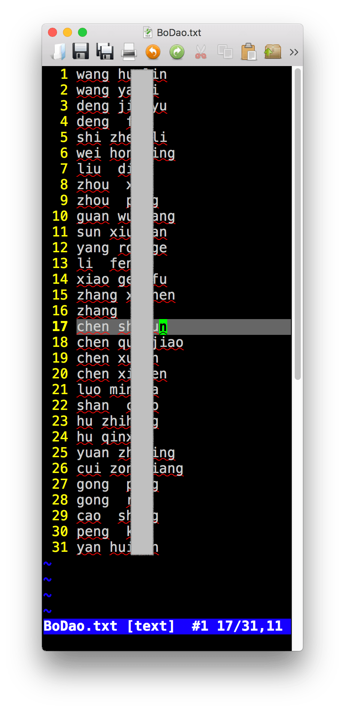
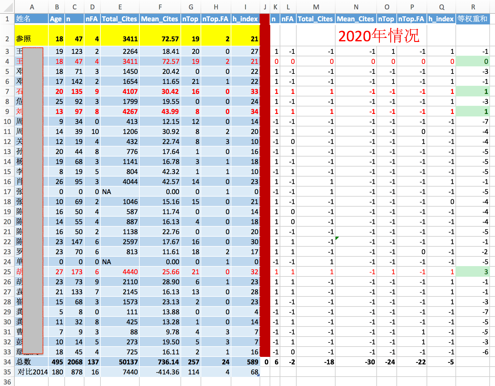

以获取武汉病毒所所有博导的发文章数据为例。

## 一 获取名单。

列出你需要获得数据的人名和研究所。 人名和单位名字都必须是英文。

从此链接进入，[武汉病毒所导师介绍](http://gd.whiov.cas.cn/dsjs/201410/t20141013_261889.html)。 可以看到31为博士生导师的姓名，通过手动或者软件获得这些导师的人名拼音——即英文名。将这些英文名写入一个txt文件。*下面切图我隐去了他们的姓名。*

如：




## 从scopus获取名单上教授的发文章数据。

直接使用一下代码，其中需要路径，使得程序可以找到第一步中存储的名字列表。

*affil_id = '60027289'* 是武汉病毒所的单位代码。如果需要其他研究所，请自行查找单位代码。

*aff = 'virology'* 是病毒所的英文名关键字。

api_key ='xxx' 是你需要获取scopus一个帐号，以此来获取数据。

```
rm(list = ls())
library('rvest')
library('dplyr')
library('scholar')
# install.packages('scholar')
library(rscopus)
# source('Rcode/function/function.GS.R')

dir.data = 'wuhan'
fn.namelist = 'wuhan/BoDao.txt'
outdir = 'wuhan/out'
# Read names from fn.namelist
# download the profile html pages from GS, save them to local drive.

dir.create(outdir, showWarnings = F, recursive = T)
dir.create(dir.data, showWarnings = F, recursive = T)

tmp = readLines(fn.namelist, skipNul = T)
name.tab = as.matrix(read.table(text=tmp,header = F))
name.tab
api_key = ''
# api_key = '4f1f89830728c357bd1b9e5b18007dbf'
rscopus::set_api_key(api_key)
id=get_api_key(api_key)

aff = 'virology'

nx = nrow(name.tab)
yl=NULL
xmat=NULL
for(i in 1:nx){
  aff = 'Wuhan'
  xthis = paste(name.tab[i, ], collapse = ' ')
  message(i, '/', nx, '\t', xthis)
  first_name =  name.tab[i, 2]
  last_name =  name.tab[i, 1]
  x = get_author_info(first_name = first_name,
                      last_name =  last_name,
                      affil_id = '60027289',
                      verbose = FALSE, 
                      query = paste0("AFFIL(", aff, ")")
                      ) 
  x
  # x = author_df(first_name = first_name,
  #                     last_name =  last_name,
  #                     affil_id = '60027289',
  #                     verbose = FALSE, 
  #                     query = paste0("AFFIL(", aff, ")") ) 
  auids = x$au_id
  nres = nrow(x)
  # if(nres>1){
  #   pt1= sprintf("\\b%s\\b", name.tab[i, 2])
  #   pt2= sprintf("\\b%s\\b", name.tab[i, 1])
  #   id=which(grepl(pt1, x$auth_name) &
  #              grepl(pt2, x$auth_name) )
  #   id
  #   if(length(id)<1){
  #     stop()
  #   }
  #   x=x[id, ]
  # }
  nres = nrow(x)
  y = NULL
  if( !all(is.na(auids) )){
    if(nres > 1){
      message('\t', nres, ' au-id exit')
      print(x)
    }
    for(j in 1:nres){
      # use id to get author pub data.
      tmp = try(
        author_list(au_id = auids[j], verbose = FALSE, 
                      general = FALSE, all_author_info = F,
                      count=500), 
      silent = TRUE
      )
      View(tmp)
      if(is.data.frame(tmp)){
        y = plyr::rbind.fill(y, tmp)
      }
    }
  }else{
    message('\t', 0, ' au-id exit')
    print(x)
  }
  # x
  if(!all(is.na(x))){
    xmat = rbind(xmat, x)
  }else{
    stop()
  }
  yl[[i]] = y
}
# ret = cbind(name.tab, xmat)
# saveRDS(xmat, 'xmat.RDS')
saveRDS(yl, 'wuhan/yl.RDS')
```


程序结束后，会将获取的数据存储与文件yl.RDS


## 三 分析数据

通过前一步获取的数据，分析几项内容： **学术年龄， 文章数，一作文章数，总引用， 平均引用， 顶级文章数目， 一作顶级期刊数目， h因子**。

完成这项需要另外一个手动完成的文件，就是顶级期刊名字。

下面是针对武汉病毒所的专业方向而选择的顶级期刊列表，包含名字和影响因子——Journal of Virology的影响因子虽然小，但却是病毒专业方向的顶级期刊。


然后使用一下代码：

```
# xmat = readRDS('xmat.RDS')
yl = readRDS('wuhan/yl.RDS')
jn = as.matrix(read.table('wuhan/TopJ2.txt', sep=','))
jn
nx=length(yl)
jj=NULL

fx <- function(xx){which(grepl(paste0('^', xx, '$')  , x$journal) )  }
hinx <- function(x){
  for(i in 1:length(x)){
    if(length(which(x>=i)) <i ){
      return(i)
    }
  }
}
xmat = NULL
for(i in 1:nx){
  x = yl[[i]]
  # jj = c(jj, x$journal)
  top.j = apply(cbind(jn[, 1]), 1, fx)
  top.id = unlist(top.j)
  top.fa = sum(which(x$auth_order == 1) %in% top.id)
  top.n = length(unlist(top.j))
  if(is.null(x)){
    nt=0
  }else{
    tt = as.Date(x$cover_date)
    nt = 2020 - as.numeric(format(min(tt), '%Y'))
  }
  xi = c( 
    nt,
    nrow(x),
          sum(x$auth_order==1, na.rm = TRUE),
          sum(x$citations, na.rm = TRUE),
          mean(x$citations, na.rm = TRUE), 
          top.n,
          top.fa,
          hinx(x$citations)
  )      
  xmat = rbind(xmat, xi)
}
xmat = data.frame(name.tab, xmat)
colnames(xmat) = c('Family', 'First', 'Age',
                   'n', 'nFA', 'Total_Cites', 
                   'Mean_Cites', 'nTop', 'nTop.FA', 'h_index'
                   )
write.table(xmat, 'wuhan/out.csv', col.names = T, row.names = F, sep='\t', quote = F)
View(xmat)
```


程序完成后，会存储结果到out.csv文件。


## 四 额外的分析。

这部分数据分析比较简单，我使用***WPS表格***完成，如果数据量大或者需要不断重复验证，也完全可以使用R来完成。

使用***WPS表格***分析的结果。



作为案例，数据中的人名我就不展示了。


**如果有人愿意以此做个更大范围的研究，欢迎合作。**