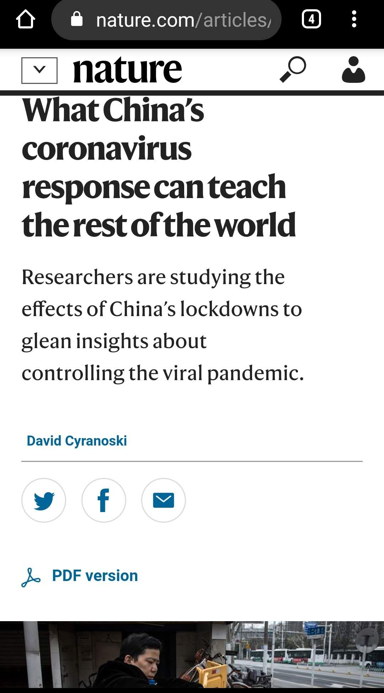
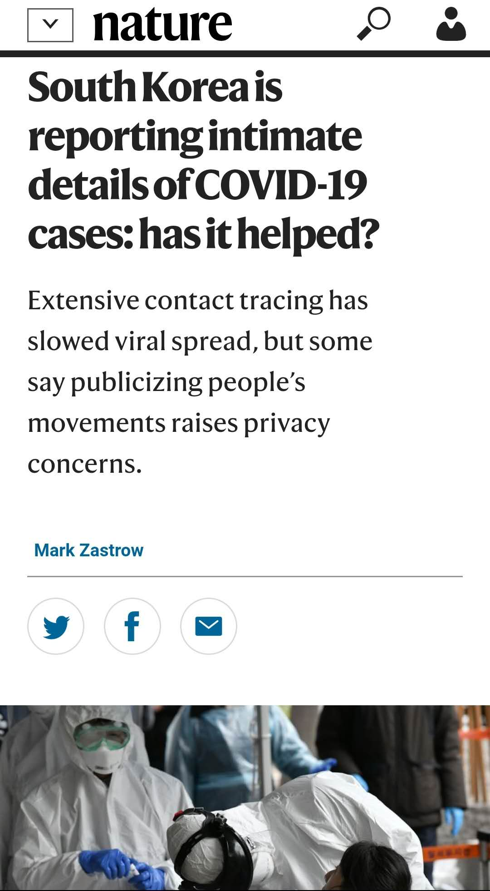
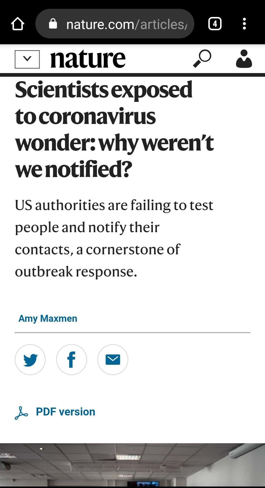

最新一期Nature里面三篇很好的文章。 

Coronapod: “Test, test, test!” https://www.nature.com/articles/d41586-020-00864-1

访谈音频，21分钟，谈到了下面三篇文章内容。 最重要强调“检测，检测，还是检测”

What China’s coronavirus response can teach the rest of the world https://www.nature.com/articles/d41586-020-00741-x

世界应该从中国学什么，总结了中国措施的有效性和显著效果，作者认为成功的主要经验就是尽可能的检测和跟踪确诊者的行动轨迹找出所以密切接触者。 没有作者的总结我都不知道中国措施的效果如此显著。不过他提醒现在说成功为时过早，要等复工开学之后再判断。

South Korea is reporting intimate details of COVID-19 cases: has it helped? https://www.nature.com/articles/d41586-020-00740-y

总结韩国经验。归功于韩国大量检测，严密跟踪病人的轨迹，虽然看客质疑个人隐私保护问题。

Scientists exposed to coronavirus wonder: why weren’t we notified? https://www.nature.com/articles/d41586-020-00823-w

总结美国的失败：**没有足够检测量**，**检测标准依然很高**（无症状不检测），**没有隔离无症状密切接触者**（尽管明知无症状也传染），**隔离措施形同儿戏**（全靠自觉），**不能跟踪患者和接触者的轨迹**。一句话：应做的要么都没做，要么马马虎虎。

另：介绍韩国那篇文章作者是我们的老朋友Mark Zastrow——说中国植树造林造成水资源短缺的人。他是韩国裔，一直很关心爱护韩国，有关韩国的文章写得都有水平。 反观华裔新闻记者，都一边倒都抹黑中国的，能够说几句公道话的反而还是纯外国人。