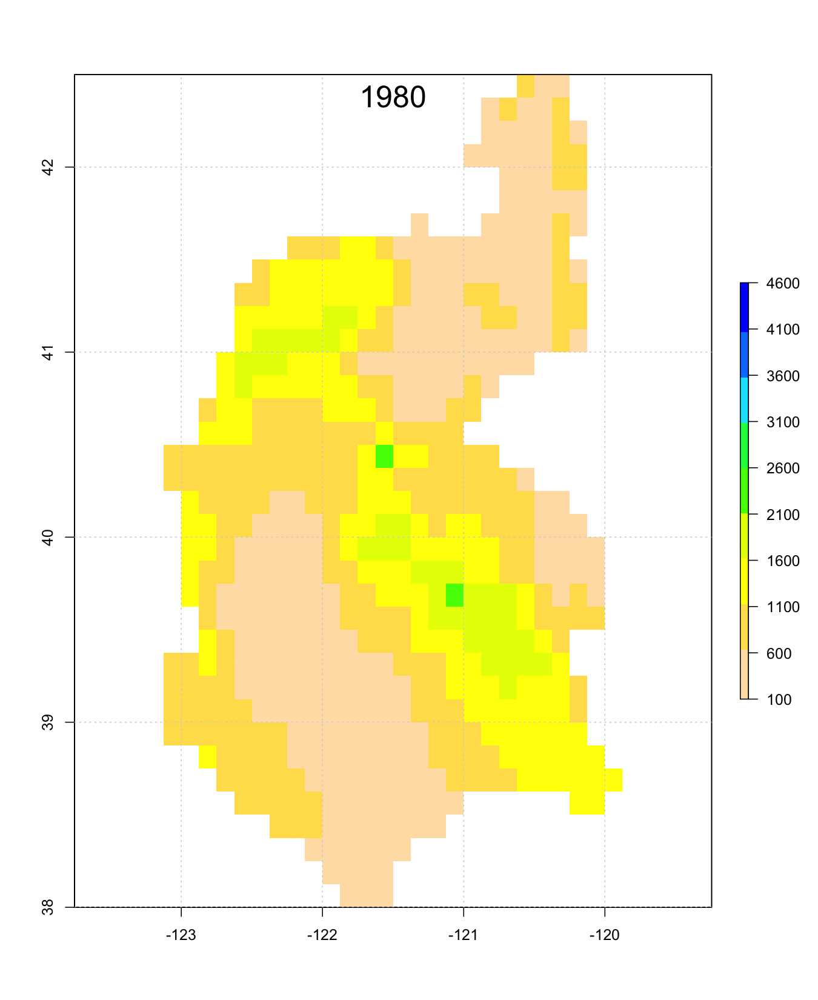
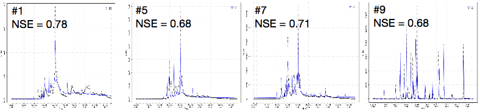
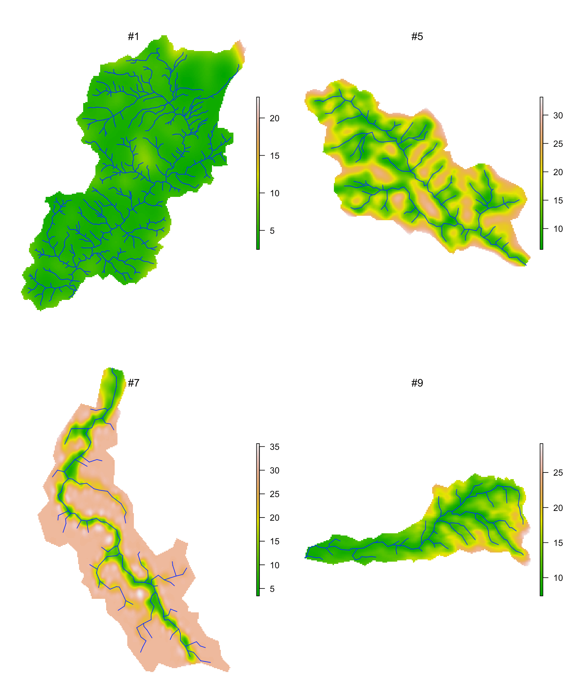

## Introduction of HYPERION [<i class="fas fa-external-link-alt"></i>](https://climate.ucdavis.edu/hyperion/)
The objective of HYPERION is the development of a comprehensive regional hydroclimate data assessment capability focused on feature-specific metrics and stakeholder-relevant outcomes. The secondary objective of this proposal is to leverage this assessment capability to improve our ability to predict these outcomes, by identifying the process-level drivers of outcome biases and evaluating the most appropriate and efficient ways to couple climate models, hydrologic models, and models of human impacts.

## Tasks in hydrologic modeling
* Develop a hydrologic modeling system for both the Sacramento watershed and several subcatchments.  Calculate key hydrological metrics, including stream flow, groundwater table, soil moisture, and snow pack.
* Evaluate the quality of the hydrologic model and identify potential issues related to its performance.
* Develop a statistical downscaling technique using both traditional statistical and machine learning methods that digests input to the hydrologic model and mimics the output of the model.
* Determine which input variables are most relevant for producing an accurate statistical model.

Spatial Data             |  Annual Precipitation
:----------------------:|:-------------------------:
  | 

## Sacramento Watershed

The Sacramento River flows from Southern Oregon and to San Francisco Bay. Total drainage area is ~72000 km2. Elevation ranges from 0 to 4200m. The climate in SW is semi-arid hot Mediterranean. The spatial climatic characteristics are not only affected by latitude, terrain and snow coverage, but also by wind and ocean currents. Dramatic seasonal and annual climatic variations exist as well as large spatial heterogeneity. The mountains on the eastern and northern edges of the domain accumulate rain and snow which funnels into the groundwater of the whole watershed.  Annual precipitation ranges from 400 mm/year to 1500 mm/year, however extreme annual precipitation was more than 4000 mm/year in Northern mountainous area in 1983, and mean precipitation was only 270 mm/year from the 2013 extreme drought year.

<figure class="image">
  
  <figcaption>Animation of spatial annual precipitation in Sacramento Watershed</figcaption>
</figure>

| Monthly variation of precipitation in Sacramento Watershed             |  Annual precipitation variation from 1979 to 2017 based on NLDAS data
| :----------------------:|:-------------------------:
|   | 

## Simulation and Results
The calibration of the PIHM model used the Covariance Matrix Adaptation Evolution Strategy (CMA-ES) (Hansen 2006,Auger 2005). The automatic CMA-ES calibration is robust and able to converge to global optimization with low computing cost.

### River discharge
The stream flow in the watershed follows the seasonal variation of precipitation. During drought years, the base flow from groundwater depletion contributes to the streamflow, and the excess infiltration replenishes ground water in wet seasons. For small watersheds in the Central Valley, such as catchment #9 where precipitation is less and the aquifer is thicker, the contribution from groundwater is small.
<figure class="image">
  
  <figcaption>Calibration based on discharge of four subcatchments</figcaption>
</figure>

### Ground water variation
The ground water near the river channel is shallower than the hill-slope. The spatial distribution pattern of ground water is controlled by topography, soil/geology characteristics and shape of the watershed. Steep slopes store less ground water than moderate slopes, because a steep hydraulic gradient on steep slopes drive the lateral groundwater flow.

|                         |    
| :----------------------:|:-------------------------:
|       | 
|  Ground water spatial distribution | Temporal fluctuation from 2000 to 2017.

Ground water seasonal fluctuation follows the climatic variation. However, the seasonal variations in some catchments are relatively larger than others. The inter-annual variation in #5 sub-catchment is larger than seasonal variation. Although the annual precipitation trends in each sub-catchments are comparable, the trend in multiple-year changes of ground water table varies. This requires further analysis on water balance and the memory effect of ground water storage.
