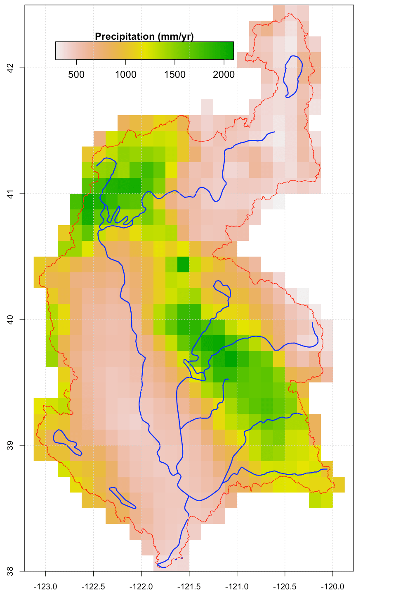

+++
title = "Model simulated spatial distribution and the variation of ground water level in Sacramento Watershed, California from 1985 to 2017"
date = 2018-12-01T00:00:00  # Schedule page publish date (not talk date).

# Authors. Comma separated list, e.g. `["Bob Smith", "David Jones"]`.
authors = ["Lele Shu", "Paul Ullrich"]

# Talk start and end times.
#   End time can optionally be hidden by prefixing the line with `#`.
time_start = 2018-12-11T13:00:00
time_end = 2018-12-11T18:00:00
all_day = false

# Location of event.
location = "Washington DC, United States"

# Name of event and optional event URL.
event = "H23J-2030 "
#event_url = "https://example.org"

# Abstract. What's your talk about?
abstract = "The Sacramento watershed is the largest watershed in California, and an invaluable source of freshwater for communities, agriculture and ecosystems within the State. Nonetheless this watershed remains susceptible to dramatic shifts in water storage, which relate to changes in snowpack and groundwater. Over the coming century, groundwater withdrawals and precipitation variability are anticipated to put significant stress on this resource.  Further, historical drought has had a pronounced effect on groundwater tables in this watershed, and recovery following a drought tends to be slow.  In order to prepare for the impacts of future drought, an accurate assessment of historical water levels would be invaluable.   This study is aim to investigate the change and spatial distribution of groundwater level in the Sacramento Watershed over the past 33 years (1985-2017), through the simulation with the Penn State Integrated Hydrologic Model (PIHM). As a physically-based hydrologic model, the PIHM is able to provide the spatial distribution of ground water and fluctuation of ground water table under the climate variation. The study begins with the calibration and analysis of 14 headwater sub-watersheds where managed reservoirs are not present, since modeling of these headwaters does not require knowledge of reservoir operations. From these results, calibrated parameters are then applied to the entire Sacramento watershed.  Our results will identify trends in groundwater storage, changing spatial distribution of the ground water over the past 33 years, and recharge and depletion rates of groundwater in historic drought and wet years."

# Summary. An optional shortened abstract.
summary = "Poster in AGU 2018 Fall meeting"

# Is this a featured talk? (true/false)
featured = true

# Tags (optional).
#   Set `tags = []` for no tags, or use the form `tags = ["A Tag", "Another Tag"]` for one or more tags.
tags = ["Poster", "Hydrologic Modeling", "PIHM"]

# Markdown Slides (optional).
#   Associate this talk with Markdown slides.
#   Simply enter your slide deck's filename without extension.
#   E.g. `slides = "example-slides"` references
#   `content/slides/example-slides.md`.
#   Otherwise, set `slides = ""`.
# slides = "example-slides"

# Optional filename of your slides within your talk folder or a URL.
url_slides = ""

# Projects (optional).
#   Associate this talk with one or more of your projects.
#   Simply enter your project's folder or file name without extension.
#   E.g. `projects = ["deep-learning"]` references
#   `content/project/deep-learning/index.md`.
#   Otherwise, set `projects = []`.
projects = ["internal-project"]

# Links (optional).
# url_pdf = "talk/agu2018/poster.pdf"
url_video = ""
url_code = ""

# Featured image
# To use, add an image named `featured.jpg/png` to your page's folder.
[image]
  # Caption (optional)
  caption = "Watershed of Sacramento"

  # Focal point (optional)
  # Options: Smart, Center, TopLeft, Top, TopRight, Left, Right, BottomLeft, Bottom, BottomRight
  focal_point = "Smart"
+++

<figure class="image">
  
  <figcaption>Annual Precipitation (1985-2017) of Sacramento Watershed</figcaption>
</figure>

**Please stop by my poster, we can have a talk.**
